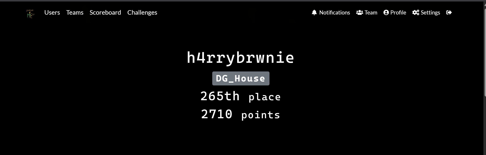
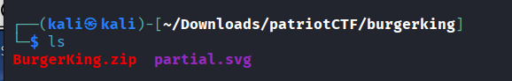
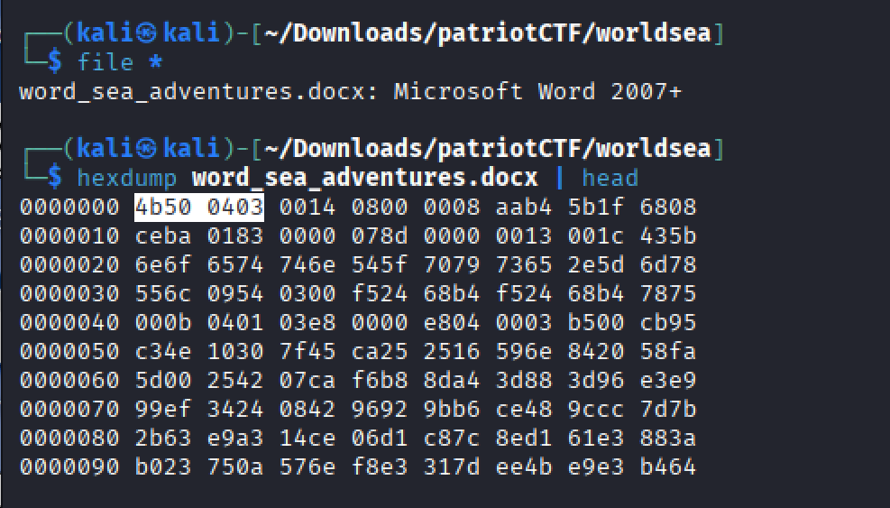

# PatriotCTF_Wrireups
Collection of my personal writeups for **PatriotCTF**, covering **Forensics** category
https://ctftime.org/event/2850
These writeups document:
- My thought process  
- Tools used  
- Key techniques learned  
- Challenge solutions with detailed steps  

This repo is mainly for study purposes.

---

**Author:** *h4rrybrwnie*  

---

# Burger King - Writeup

**Category: Forensics/Crypto**

## Description

We are given:

- An encrypted ZIP archive that supposedly contains “evil plan”
- A small recovered fragment of an SVG file (partial.svg), only 39 bytes long

The task:

**Recover the contents of the encrypted ZIP and obtain the flag CACI{…}**

The challenge description hints that the recovered SVG fragment is important → This is the strong hint toward a **know-plaintext attack**

## File Provided

## Initial Analysis

**Observations:**

- Compression method = store → not compressed
- ZIP Version = 2.0 → old format ZIP
- Each file when trying to unzip show “incorrect password”

**→ Legacy ZipCrypto, not AES Encryption**

ZipCrypto is extremely weak and can be broken with a few bytes of know plaintext (> 12 bytes)

## Failed Password Cracking Attempt

At first, I thought that it can easily be crack by dictionary cracking

But no password is cracked

**→ Not the password brute-force challenge**

## Key Insight

The content inside the **partial.svg** is the standard header of an SVG file

Because:

- We know plaintext of the beginning of one entry
- ZIP uses ZipCrypto
- Plaintext ≥ 12 bytes

→ Can try to perform a know-plaintext attack using bkcrack

## Preparing

At this time, I am preparing for recovering the ZipCrypto Keys

## Recovering

Attack the first entry Hole.svg **(as hinted)**

bkcrack successfully recovers keys:

**We now have the three internal ZipCrypto keys**

These key can decrypt all files in the archive, regardless of password

## Decrypt

Since the files were **method=store → output is the raw plaintext SVG**

# World Sea Adventures -Writeup

**Category: Forensics/Steg**

## Description

We are given a Word document.

The task is look closely inside the document

**Flag format: tctf{…} or pctf{…}**

No password is required

## Inspect

**Modern Microsoft Offices formats (.docx, .xlsx, pptx) are ZIP Archives** following the Office Open XML Standard. This mean a .docx file can be opened like a ZIP file

To verify:

After acknowledge it is a ZIP archives, first thing to do is extract, then we can see many files inside like .jpg (crab.jpb, sponge.jpg, squid.jpg). At that time, I think that all of other files (most likely is xml files) do not need to pay attention to. Because I can see three image files look more suspicious. 

With 3 suspicious files, the first thing come up on my mind is this challenge can be **steganography** in image. So I try to use my knowledge about that field (like exiftool, strings, identify,binwalk, …) **but got no flags :(**

## Steghide

Steghide is a common tool used to embed files into JPEG images

Steghide does not ask for a passphrase, which strongly suggests the embedding is intentional and part of the challenge.

**After extracted 2/3 images provided, I got the flag**. Kinda easy?

