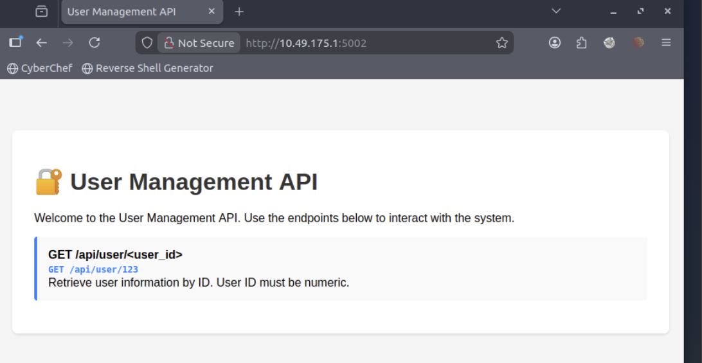

# OWASP TOP 10 2025

# AS02: Security Misconfigurations

After accessed to the page, I can see the tutor about API to get users

When use an API to get information about user 123, the page response the JSON object

But how about access to negative user ID?

→ FLAG: THM{V3RB0S3_3RR0R_L34K}

# ASO3: Software Supply Chain Failures

This challenge give me the code show how API work

Observe that there is a condition that check whether the payload “data” has the value “debug”

If i send a request with POST method and payload include JS object like **{”data”:”debug”}**

Here is the server’s response

→ Flag: THM{SUPPLY_CH41N_VULN3R4B1L1TY}

# A04: Cryptographic Failures

Based on the hint, I had guessed the actual KEY to encrypt messages is “KEY1”

# A05: Injection

Based on the hint, I wrote some script that make server print the content of flag.txt out

# AS06: Insecure Design

This challenge assume that we must download there app to read the message. But I get some APIs that include list of user and get API include there messages

→ Flag: THM{1NS3CUR3_D35IGN_4SSUMPT10N}

# A08: Software or Data Integrity Failures

This script below serialize the payload that print the flag.txt out, due to the insecure deserialize, the server print the content of flag out.

