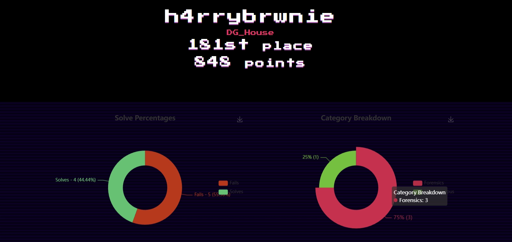
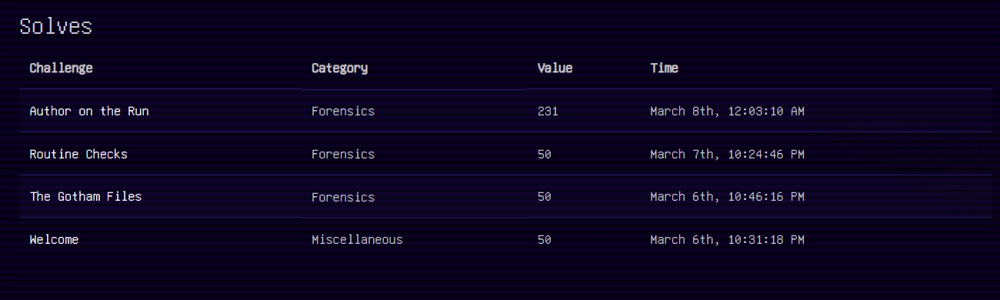
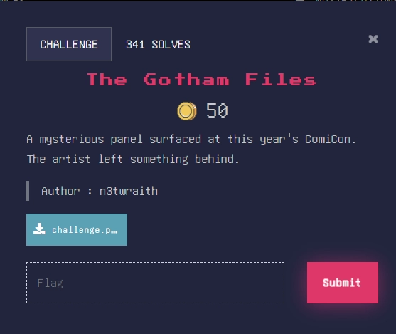
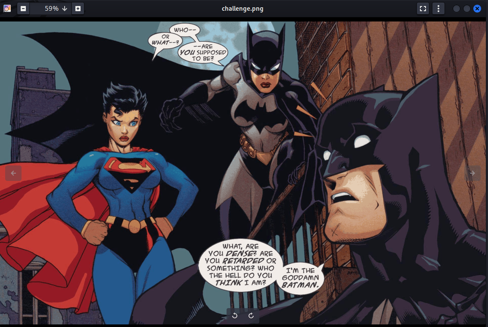
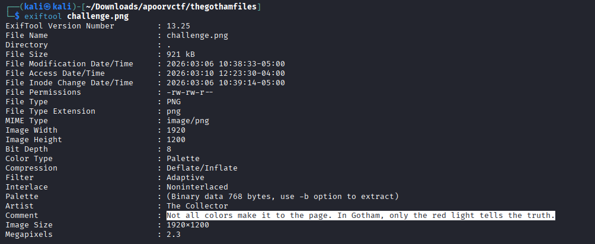
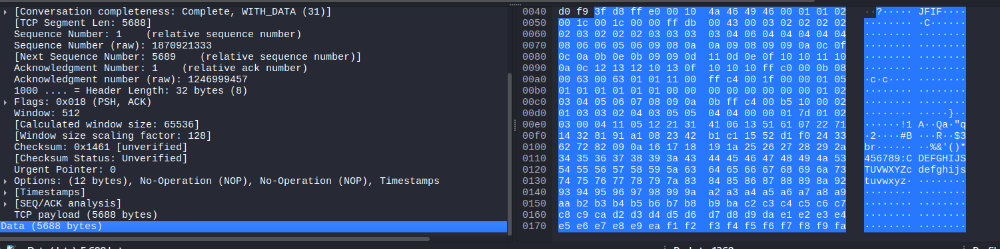
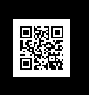
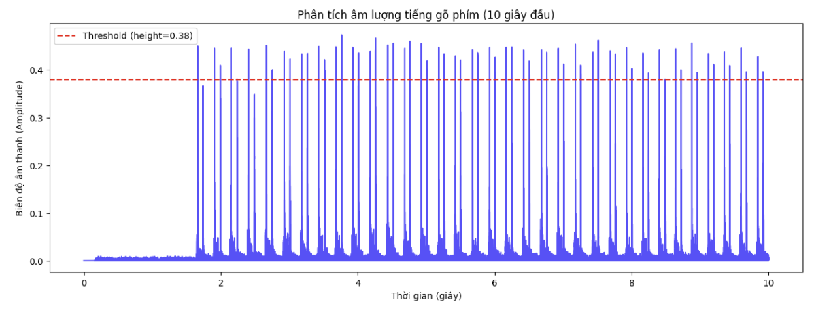

This is my writeups about apoorvCTF 2026, on ctftime (https://ctftime.org/event/3171). You can observe my result with the account name **h4rrybrwnie**. 

In ApoorvCTF 2026, our team got **848 points**. During this event, I focused heavily on the Forensics category, successfully solving 3 challenges. This repository contains my step-by-step writeups and methodologies for solving these challenges, going from initial analysis to extracting the final flags. Hope you find it helpful!



# Writeup: The Gotham Files (Forensics / Steganography)

## Initial Analysis
When open the challenges file, we got this image

Analyzing the provided PNG file with `exiftool` reveals suspicious metadata:
* **Comment:** *"Not all colors make it to the page. In Gotham, only the red light tells the truth."*
* **Palette:** 768 bytes of binary data.

A standard PNG palette (PLTE chunk) consists of RGB triplets (Red, Green, Blue) for up to 256 colors (256 * 3 = 768 bytes). The hint explicitly points to the "red light", indicating that the flag is hidden sequentially inside the **Red** channel of the color palette.

## Data Extraction
We need to extract the raw binary data of the Palette chunk for analysis. Using `exiftool` with the `-b` (binary) flag allows us to dump this specific chunk into a file:

```c
exiftool -Palette -b challenge.png > palette.bin
```
## Decoding the Flag
The extracted palette.bin file contains the sequence [R, G, B, R, G, B...]. We can use a short Python script to read the binary file, extract every first byte of each RGB triplet (index 0, 3, 6...), and convert those integer values into ASCII characters.

```c
with open('palette.bin', 'rb') as f:
    data = f.read()

flag = ""

# Iterate through the bytes, stepping by 3 to grab only the Red bytes
for i in range(0, len(data), 3):
    red_byte = data[i]
    
    # Ignore null bytes (0x00) typically used for padding
    if red_byte != 0: 
        flag += chr(red_byte)

print(f"Flag: {flag}")
```
After used the script above, we got this flag `apoorvctf{th3_c0m1cs_l13_1n_th3_PLTE}`

# Writeup: Routine Checks (Network Forensics / Steganography)

## Challenge Description
*Routine system checks were performed on the city’s communication network after reports of instability. Operators sent brief messages between nodes to confirm everything was running smoothly. Most of the exchanges are ordinary status updates, but one message stands out as… different.*

## Phase 1: Network Traffic Analysis
The prompt mentions "routine checks" and "brief messages. The hint that one message "stands out" suggests an anomaly, likely in the packet size.
Filter the PCAP file to isolate the anomalous packet and extract its hidden payload.



## Phase 2: File Carving & Magic Bytes Repair
The extracted hex stream begins with `3fd8ffe000104a464946...`. Translating `4a 46 49 46` to ASCII reveals the string **JFIF**, indicating this payload is actually a JPEG image. However, standard JPEG magic bytes are `FF D8 FF E0`. The first byte (`3f`) was intentionally corrupted to prevent automated extraction tools (like `binwalk`) from easily finding it.
Fix the corrupted file signature and convert the raw hex back into a valid image file.

1. Manually change the first byte of the copied data from `3f` to `ff` to restore the correct header (`ffd8ffe0...`).
2. Save this corrected hex string into a text file named `hexdata.txt`.
3. Use the `xxd` command-line utility to reverse the plain hex dump into a binary file:
```c
   xxd -r -p hexdata.txt > suspect_image.jpg
```
## Phase 3: Bypassing the Rabbit Hole & Steganography
Opening the repaired image reveals a QR code. Scanning it yields a fake flag. In CTFs, an easily accessible flag on the surface is almost always a "rabbit hole" designed to distract you. The real flag is hidden deeper within the image's structure.

Apply JPEG-specific steganography techniques to extract the actual hidden data.


1. Use steghide, a standard tool for embedding and extracting data within JPEG files.

2. Run the extraction command
```c
steghide extract -sf suspect_image.jpg
```
3. This successfully extracts the hidden file containing the real flag, completing the challenge.

And we got the real one `apoorvctf{b1ts_wh1sp3r_1n_th3_l0w3st_b1t}`

# Writeup: Author on the run (Forensics / Acoustic Cryptanalysis)

## Challenge Description
*No time to explain! The organizers are after me — I stole the flag for you, by sneakily recording their keyboard. I managed to capture their keyboard keypresses before the event— every key (qwertyuiopasdfghjklzxcvbnm) pressed 50 times—don’t ask how. Then, while they were uploading the real challenge flag to CTFd, I left a mic running and recorded every keystroke. Now I’m on the run. If the organizers catch you with this, you never saw me. Good luck — and hurry!*
*Flag format: apoorvctf{decoded_text}*

## Phase 1: Initial Analysis & Audio Visualization
We are given two files:
* `reference.wav`: The training data. It contains the sequence `qwertyuiopasdfghjklzxcvbnm`, with each key pressed 50 times. This means we should expect exactly 26 * 50 = 1300 keystrokes.
* `flag.wav`: The target data. By listening to the audio manually, we can clearly hear exactly **19 keystrokes**.

This is a classic **Acoustic Keylogging** (or Acoustic Cryptanalysis) challenge. Because each mechanical switch and its position on the keyboard creates a unique sound signature, we can train a Machine Learning model using the `reference.wav` and use it to decode `flag.wav`.

First, to properly extract the audio of each keystroke, we need to find the "peaks" (the moment the key hits the bottom) in the audio waveform. Visualizing the first 10 seconds of the reference audio helps us determine the correct amplitude threshold to filter out background noise.




## Phase 2: Feature Extraction & Machine Learning
To process the data, we perform the following steps:
1.  **Peak Detection & Slicing:** We use `scipy.signal.find_peaks` to locate the keystrokes. Since CTF audio files often contain extra noises (like breathing, mouse clicks, or double-bounces), we implement a sorting mechanism to grab exactly the top 1300 loudest peaks for the reference, and the top 19 for the flag.
2.  **MFCC Extraction:** We use `librosa` to extract Mel-frequency cepstral coefficients (MFCCs). We must `.flatten()` the matrix instead of averaging it, preserving the time-domain characteristics of the sound (the difference between the initial click and the bottom-out sound).
3.  **Model Training:** We use a **K-Nearest Neighbors (KNN)** classifier with `n_neighbors=1`. KNN works exceptionally well for this specific scenario because it directly compares the target audio snippet to the closest matching signature in the training set.

Here is the unified Python script used to solve the challenge:

```python
import librosa
import numpy as np
from scipy.signal import find_peaks
from sklearn.preprocessing import StandardScaler
from sklearn.neighbors import KNeighborsClassifier
import warnings

warnings.filterwarnings('ignore')

def extract_keystrokes(file_path, slice_duration=0.05, expected_count=None, height_thresh=0.2):
    y, sr = librosa.load(file_path, sr=None)
    y_abs = np.abs(y)
    
    # Find peaks based on visual threshold
    peaks, properties = find_peaks(y_abs, height=height_thresh, distance=int(sr * 0.1))
    
    # Filter the exact number of expected keystrokes by grabbing the loudest peaks
    if expected_count is not None and len(peaks) > expected_count:
        peak_heights = properties['peak_heights']
        top_indices = np.argsort(peak_heights)[-expected_count:]
        peaks = np.sort(peaks[top_indices]) # Re-sort chronologically
        
    keystrokes = []
    slice_samples = int(sr * slice_duration)
    half_slice = slice_samples // 2
    
    # Slice the audio exactly to maintain consistent array shapes
    for peak in peaks:
        start = peak - half_slice
        end = start + slice_samples
        if start >= 0 and end <= len(y):
            keystrokes.append(y[start:end])
            
    return keystrokes, sr

def extract_features(keystrokes, sr):
    features = []
    for audio in keystrokes:
        mfcc = librosa.feature.mfcc(y=audio, sr=sr, n_mfcc=20)
        # Flatten to preserve temporal data
        features.append(mfcc.flatten())
    return np.array(features)

# --- 1. Prepare Training Data ---
print("[*] Processing reference.wav...")
ref_keys, sr = extract_keystrokes('reference.wav', expected_count=1300, height_thresh=0.2)
X_train = extract_features(ref_keys, sr)

sequence = "qwertyuiopasdfghjklzxcvbnm"
y_train = []
for char in sequence:
    y_train.extend([char] * 50)
y_train = np.array(y_train)

# --- 2. Train Model (KNN) ---
print("[*] Training KNN Model...")
scaler = StandardScaler()
X_train_scaled = scaler.fit_transform(X_train)

model = KNeighborsClassifier(n_neighbors=1, weights='distance')
model.fit(X_train_scaled, y_train)

# --- 3. Process Target & Predict ---
print("[*] Processing flag.wav...")
# We manually counted 19 keystrokes in the flag audio
flag_keys, flag_sr = extract_keystrokes('flag.wav', expected_count=19, height_thresh=0.2)
X_test = extract_features(flag_keys, flag_sr)
X_test_scaled = scaler.transform(X_test)

predictions = model.predict(X_test_scaled)
decoded_text = "".join(predictions)

print(f"\n[+] Raw Predicted Output: {decoded_text}")
```

## Phase 3: Bypassing AI Inaccuracies
Running the script yields the following raw output:
`Raw Predicted Output: ohyougohisfaardaamn`

Due to physical variations in human typing (force, angle, speed) and the acoustic similarities between adjacent keys, the ML model made a few minor misclassifications. However, the output is highly readable. Applying human intelligence, we can easily reconstruct the intended meaningful English sentence:
* `ohyou` -> **oh you**
* `gohis` -> **got this** (The model confused 't' for 'h' and 'i')
* `faar` -> **far**
* `daamn` -> **damn**

Combining these, the logical phrase is: **"oh you got this far damn"**

Wrap it in the required format, and we have our flag `apoorvctf{ohyougotthisfardamn}`