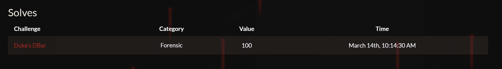
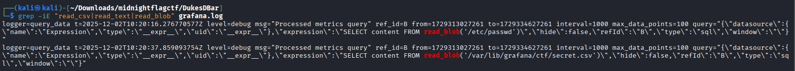
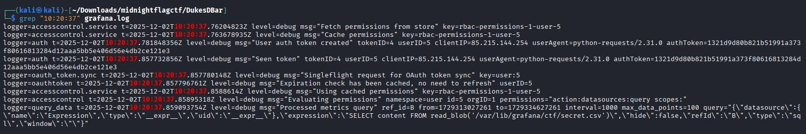
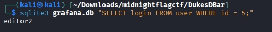

# Overview
Here is my writeup about Midnight Flag CTF - 2026. Here's the ctftime link: https://ctftime.org/event/3105

# CTF Writeup: DukesDBar (Midnight Flag CTF)
**Category:** Forensics  
**Author:** h4rrybrwnie 

## Challenge Description
> A serial killer doesn't just take lives — he takes identities.
> In every case, investigators find the same afterimage: the victim's accounts are briefly used to access their own infrastructure, as if the killer wanted someone to watch what he did next. Then everything goes quiet again.
> Last night, a Grafana monitoring instance tied to a victim's environment was exposed to the Internet for a short window. During that time, a local file was exfiltrated using a recent vulnerability.
> 
> **Artifacts provided:** `grafana.log`, `grafana.db`  
> **Objective:** Find the CVE, exfiltrated file path, attacker IP, and compromised username.  
> **Flag Format:** `MCTF{CVE-XXXX-XXXXX:path:ip:username}`

---



## Executive Summary (TL;DR)
The attacker exploited **CVE-2024-9264** (a DuckDB SQL Injection vulnerability in Grafana) to achieve Local File Inclusion (LFI). By using a Python script, they bypassed the Web UI and directly queried the Grafana API to exfiltrate `/var/lib/grafana/ctf/secret.csv`. To blend in, they hijacked the session of an existing user (`editor2`) originating from IP `85.215.144.254`.

---

## Step-by-Step Analysis

### Step 1: Identifying the Vulnerability (The CVE)
The challenge name "DukesDBar" is a clear hint pointing towards **DuckDB**. Looking at the first few lines of `grafana.log`, the system is running Grafana `v11.0.0`. 
We need to find a recent vulnerability associated with DuckDB on Grafana that allows local file exfiltration.
A quick search for DuckDB vulnerabilities in Grafana 11 reveals a critical SQL Injection flaw that allows attackers to read local files using DuckDB's built-in functions (like `read_csv` or `read_blob`).
* **Result:** `CVE-2024-9264`

### Step 2: Locating the Exfiltrated File (The Path)
To figure out what the attacker stole, we need to find the exact DuckDB payload in the logs.
We search `grafana.log` for specific DuckDB file-reading functions (`read_blob`, `read_csv`, `read_text`).
I used `grep` to filter the log file for these keywords.

```bash
grep -iE "read_csv|read_text|read_blob" grafana.log
```

**Output snippet:**
```text
logger=query_data t=2025-12-02T10:20:16.276770577Z ... query="...\"expression\":\"SELECT content FROM read_blob('/etc/passwd')\"..."
logger=query_data t=2025-12-02T10:20:37.859093754Z ... query="...\"expression\":\"SELECT content FROM read_blob('/var/lib/grafana/ctf/secret.csv')\"..."
```
The attacker first tested the LFI with `/etc/passwd` at `10:20:16`, and then successfully exfiltrated the target file at `10:20:37`.
* **Result:** `/var/lib/grafana/ctf/secret.csv`

### Step 3: Isolating the Attacker (The IP)
The challenge explicitly mentions that the attacker *"blended into background monitoring activity and Internet noise"*. There are multiple IPs in the log (like `212.114.18.5` and automated Service Accounts), which are rabbit holes. We must focus on the exact moment the file was stolen.
We need to inspect the `logger=context` or `logger=auth` entries at the exact timestamp of the exfiltration (`10:20:37`).
I filtered the log for that specific second to find the network context.

```bash
grep "10:20:37" grafana.log
```


**Output snippet:**
```text
logger=auth t=2025-12-02T10:20:37.857732856Z level=debug msg="Seen token" tokenID=4 userID=5 clientIP=85.215.144.254 userAgent=python-requests/2.31.0 ...
```
This log entry is the smoking gun. Exactly when the query was executed, an API request was made via a Python script (`python-requests/2.31.0`) from the IP `85.215.144.254`. This proves it was an automated exploit script, not manual Web UI interaction (which is why the `query_history` table in the database was empty).
* **Result:** `85.215.144.254`

### Step 4: Unmasking the Compromised Account (The Username)
The log at `10:20:37` doesn't give us the human-readable username, but it gives us an undeniable identifier: `userID=5`. We need to map this ID back to the user account.
Query the provided `grafana.db` SQLite database to find the `login` name associated with `id = 5`.
Using `sqlite3` in the terminal, I queried the `user` table.

```bash
sqlite3 grafana.db "SELECT login FROM user WHERE id = 5;"
```


**Output:**
```text
editor2
```
The attacker hijacked the session/token of `editor2` to carry out the attack.
* **Result:** `editor2`

---

## Conclusion & Flag
By carefully avoiding the internet noise and relying on strict timestamp correlation between the SQL injection payload and the authentication logs, we successfully reconstructed the attack timeline.

Gathering all the pieces:
1. **CVE:** `CVE-2024-9264`
2. **Path:** `/var/lib/grafana/ctf/secret.csv`
3. **IP:** `85.215.144.254`
4. **Username:** `editor2`

**Final Flag:**
`MCTF{CVE-2024-9264:/var/lib/grafana/ctf/secret.csv:85.215.144.254:editor2}`